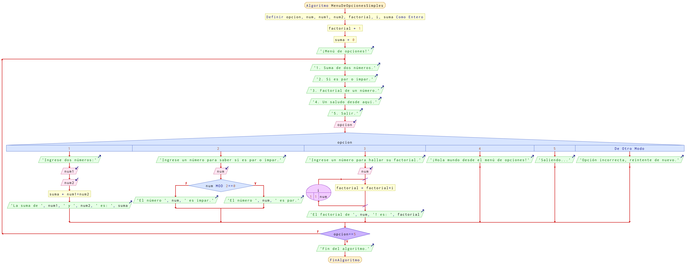

# Ejercicio 19 ciclos

## Planteamiento del problema

Realizar un ejemplo de menú, donde podemos escoger las distintas opciones hasta que seleccionamos la opción de "Salir".

### Análisis

- **Datos de entrada:** Pueden ser cuatro número enteros para las distintas opciones.
- **Datos de salida:** Distintos mensajes y cálculos, dependiendo de las opciones ingresadas.
- **Variables:** opcion, suma, num, num1, num2, factorial, i: Numéricas Enteras.
- *Cálculos*:
```C
MENÚ DE OPCIONES:
1. Suma de dos números.
2. Si es par o impar.
3. Factorial de un número.
4. Un saludo desde aquí.
5. Salir.

Para hallar el factorial:
factorial = 1
Para i Desde 1 Hasta num Con Variación + 1
    factorial = factorial * i
Fin(Para)
```

### Diseño

- Declarar las variables de tipo numérico `opcion`, `suma`, `num`, `num1`, `num2`, `factorial`, `i`.
- Inicializar las variables `suma = 0`, `factorial = 1`.
- Inicializar un bucle **HAGA** o **"REPETIR"** en el cual muestre diferentes opciones para el usuario.
    - Escribir un menú de la siguiente forma:
        ```C
        MENÚ DE OPCIONES:
        1. Suma de dos números.
        2. Si es par o impar.
        3. Factorial de un número.
        4. Un saludo desde aquí.
        5. Salir.
        ```
    - Asignar en la variable `opcion` el valor que desee el usuario.
    - Invocar una instrucción de **CASOS** en el cual se evalúe la variable `opcion`.
        - Si es uno, se realizará la suma de dos números.
            - Pedir al usuario que digite dos números y asignar dichos números en las variables `num1` y `num2` respectivamente.
            - Asignar la suma de `num1` y `num2` en la variable `suma`.
            - Escribir el resultado del valor de la variable `suma` por pantalla.
            - Utilizar la opción _SALTE_.
        - Si es dos, se realizará la operación de si un número es par o impar.
            - Pedir al usuario que digite un número y asignar dicho valor en la variable `num`.
            - Evaluar **SI** `num` el resto de la división con 2(dos) arroja como resultado 0, entonces:
                - Si es *VERDADERO*, entonces `num` es **PAR** y escribir el resultado.
                - Si es *FALSO*, entonces `num` es **IMPAR** y escribir el resultado.
            - Incluir la instrucción de _SALTE_.
        - Si es tres, se realizará la operación de hallar el factorial de un número.
            - Pedir al usuario que digite un número y asignar dicho valor en la variable `num`.
            - Crear un bucle **PARA** que `i` **DESDE** `1` **HASTA** `num` **CON VARIACIÓN** `+1`, realice lo siguiente:
                - A la variable `factorial` asignar la multiplicación de `factorial` por `i`.
                - En el *Fin(Para)* se sumará más uno la variable `i` por la **VARIACIÓN** `+1`.
                - Escribir por pantalla el resultado final de la variable `factorial`.
            - Incluir en la instrucción _SALTE_.
        - Si es cuatro, simplemente enviar un mensaje por pantalla de `"HOLA MUNDO"`.
            - Proponer la opción de _SALTE_ para dejar de preguntar en posteriores instrucciones.
        - Si es cinco, simplemente continúa hasta llegar a la condición del **MIENTRAS** del **HAGA** para dar la instrucción como cúlmino.
    - Fin de la instrucción **CASOS**.
- Con la condición de **MIENTRAS** `opcion` *NO* sea igual a la constante `5`.
- Escribir por pantalla el cúlmino del algoritmo.

## Diagrama de flujo


