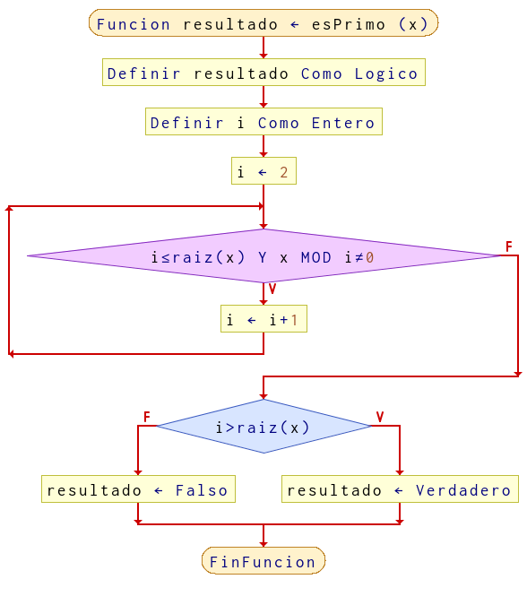
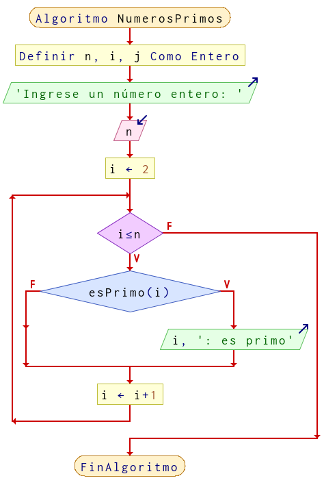

# Ejercicio 1 ciclos

## Planteamiento del problema

Mostrar en pantalla los N primeros números primos. Se pide por teclado la cantidad de números primos que queremos mostrar.

### Análisis

- **Datos de entrada:** Cantidad de números primos.
- **Datos de salida:** Cantidad de números primos impresos desde 2 hasta N.
- **Variables:** n, m, i, j: Numéricas Enteras.
- *Cálculos*: `Usar un bucle Mientras y comprobar que el número seleccionado sea divisible con uno y con él mismo.`.

### Diseño

1. Ingresar un o unos números enteros positivos.
2. Asignar dichos números en la variable "n".
3. Asignar la variable "i" en uno. Es un contador.
4. Crear una estructura repetitiva que verifique Mientras "i" sea menor o igual a la raiz cuadrada de "n" y que "i" módulo "n" sea distinto de cero.
5. Incrementar al contador "i" un uno.
6. Termina el bucle con una de las condiciones en FALSO.
7. Verificar si "i" es mayor o igual a la raiz cuadrada de "n".
8. En caso de ser VERDADERO, el número "n" es primo.
9. En caso contrario, el número ingresado no es primo.

## Diagrama de flujo

### Función de primo

### Algoritmo principal

