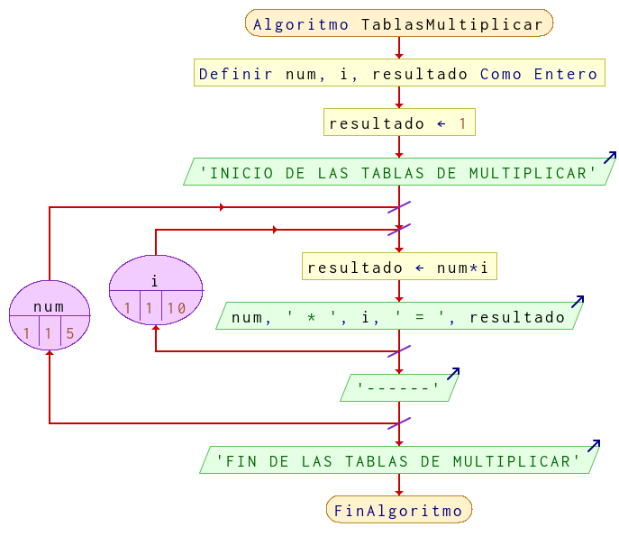

# Ejercicio 10 ciclos

## Planteamiento del problema

Algoritmo que muestre la tabla de multiplicar de los números 1, 2, 3, 4 y 5.

### Análisis

- **Datos de entrada:** Ningún dato de entradad.
- **Datos de salida:** Las tablas de multiplicar de 1, 2, 3, 4, y 5.
- **Variables:** num, i, resultado: Numéricas Enteras.
- *Cálculos*:
```C
num * i = resultado
```

### Diseño

- Declarar las variables `num`, `i`, y `resultado` como numéricas enteras.
- Inicializar `resultado` en uno.
- Escribir por pantalla "INICIO DE LAS TABLAS DE MULTIPLICAR".
- Crear un **PARA** que `num` sea uno, que sea menor o igual a cinco, y con variación más uno; realizar las siguientes operaciones.
- Inmediatamente, una instrucción **PARA** interno que `i` sea uno, que sea menor o igual a diez, y que varía en uno en uno; para luego realizar las siguientes operaciones.
- A `resultado` se le asigna el producto de `resultado` por `i`.
- Escribir por pantalla el resultado con el siguiente formato: `num * i = resultado`.
- Termina el ciclo **PARA** cuando la `i` sea mayor a 11.
- Escribir un separador con el siguiente formato: `"------"`.
- Luego comienza un nuevo ciclo del **PARA** más externo del `num`, y este acaba cuando `num` es mayor a cinco.
- Escribir por pantalla "FIN DE LAS TABLAS DE MULTIPLICAR".

## Diagrama de flujo


