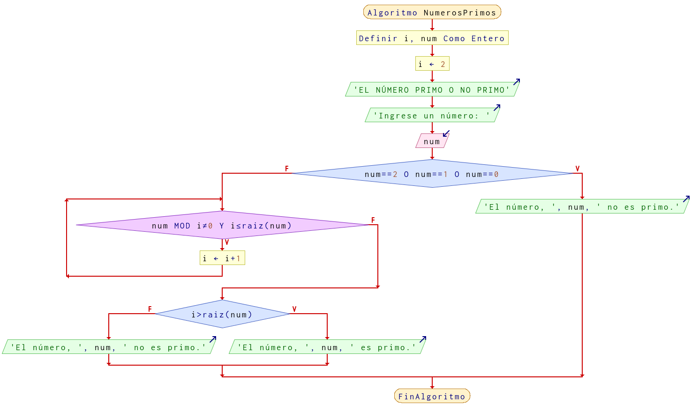

# Ejercicio 11 ciclos

## Planteamiento del problema

Escribe un programa que diga si un número introducido por teclado es o no primo. Un número primo es aquel que sólo es divisible entre él mismo y la unidad. Nota: Es suficiente probar hasta la raíz cuadrada del número para ver si es divisible por algún otro número.

### Análisis

- **Datos de entrada:**
- **Datos de salida:**
- **Variables:**
- *Cálculos*:
```C

```

### Diseño

-

## Diagrama de flujo


