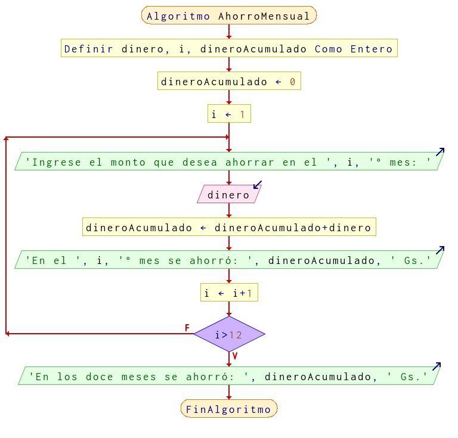

# Ejercicio 12 ciclos

## Planteamiento del problema

Realizar un algoritmo para determinar cuánto ahorrará una persona en un año, si al final de cada mes deposita cantidades variables de dinero; además, se quiere saber cuánto lleva ahorrado cada mes.

### Análisis

- **Datos de entrada:**
- **Datos de salida:**
- **Variables:**
- *Cálculos*:
```C

```

### Diseño

-

## Diagrama de flujo


