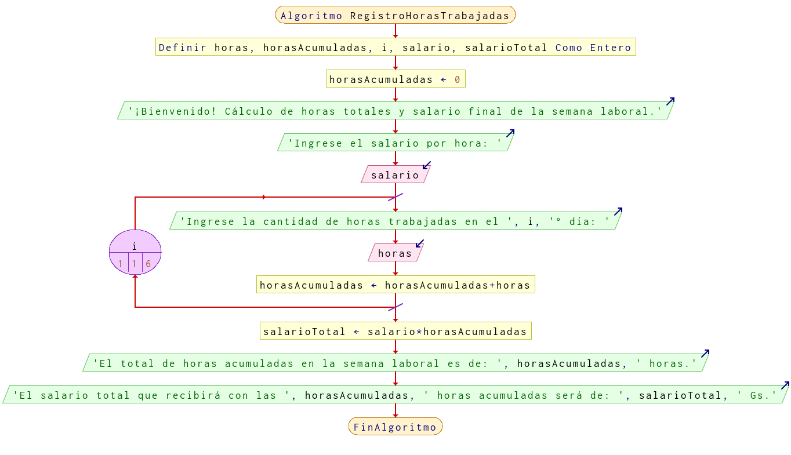

# Ejercicio 13 ciclos

## Planteamiento del problema

Una empresa tiene el registro de las horas que trabaja diariamente un empleado durante la semana (seis días) y requiere determinar el total de éstas, así como el sueldo que recibirá por las horas trabajadas.

### Análisis

- **Datos de entrada:**
- **Datos de salida:**
- **Variables:**
- *Cálculos*:
```C

```

### Diseño

-

## Diagrama de flujo


