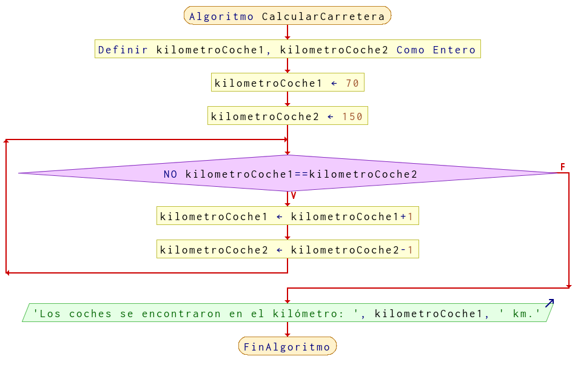

# Ejercicio 14 ciclos

## Planteamiento del problema

Una persona se encuentra en el kilómetro 70 de una carretera, otra se encuentra en el km 150, los coches tienen sentido opuesto y tienen la misma velocidad. Realizar un programa para determinar en qué kilómetro de esa carretera se encontrarán.

### Análisis

- **Datos de entrada:** Ningún dato de entrada.
- **Datos de salida:** El kilómetro de la carretera en que se encontrarán.
- **Variables:** kilometroCoche1, kilometroCoche2: Numéricas Enteras.
- *Cálculos*:
```C
El kilometraje del primer coche incrementa.
El kilometraje del segundo coche decrementa.
Cuando los kilometrajes son iguales, eso quiere decir que ambos coches se cruzaron.
```

### Diseño

- Declarar e inicializar en 70 y 150 las variables `kilometroCoche1` y `kilometroCoche2` respectivamente.
- Crear un bucle **MIENTRAS** que `kilometroCoche1` no sea igual que `kilometroCoche2`, realizar las siguientes operaciones.
- Incrementar en uno el `kilometroCoche1`.
- Decrementar en uno el `kilometroCoche2`.
- El ciclo se sale cuando los kilometrajes son iguales.
- Escribir por pantalla en qué kilómetro se encontrarán.

## Diagrama de flujo


