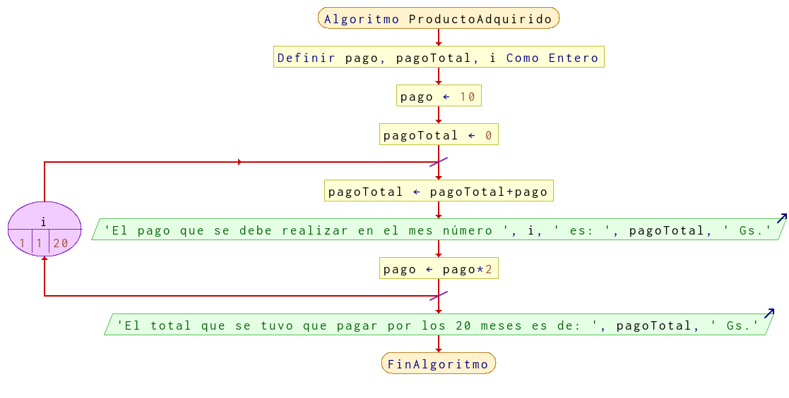

# Ejercicio 15 ciclos

## Planteamiento del problema

Una persona adquirió un producto para pagar en 20 meses. El primer mes pagó 10 €, el segundo 20 €, el tercero 40 € y así sucesivamente. Realizar un algoritmo para determinar cuánto debe pagar mensualmente y el total de lo que pagó después de los 20 meses.

### Análisis

- **Datos de entrada:** Ningún valor de entrada.
- **Datos de salida:** La paga mensual y el total de lo que pagó después de los 20 meses.
- **Variables:** pago, pagoTotal, i: Numéricas Enteras.
- *Cálculos*:
```C
i = 1
pago = 10
pagoTotal = 0
Para i Desde 1 Hasta 20 Con Variación + 1
    pagoTotal = pagoTotal + pago
    Escriba("El ", i, "° mes debe pagar: ", pagoTotal)
    pago = pago * 2
Fin(Para)
```

### Diseño

- Declarar las variables `pago`, `pagoTotal`, e `i` como numéricas enteras.
- Inicializar `i` en uno, `pago` en 10, y `pagoTotal` en cero.
- Realizamos un ciclo **PARA** que `i` desde uno hasta 20 con variación más uno se puedan realizar las siguientes operaciones.
- Al `pagoTotal` se le asigna la suma de `pagoTotal` más `pago`.
- Escribir por pantalla para indicar al usuario que en el mes número `i` debe pagar `pagoTotal`.
- A `pago` asignar el producto de `pago` multiplicado por 2.
- El ciclo **PARA** termina cuando la `i` es mayor a 20.
- Escribir por pantalla para indicar al usuario el monto total que pagó en los 20 meses.

## Diagrama de flujo


