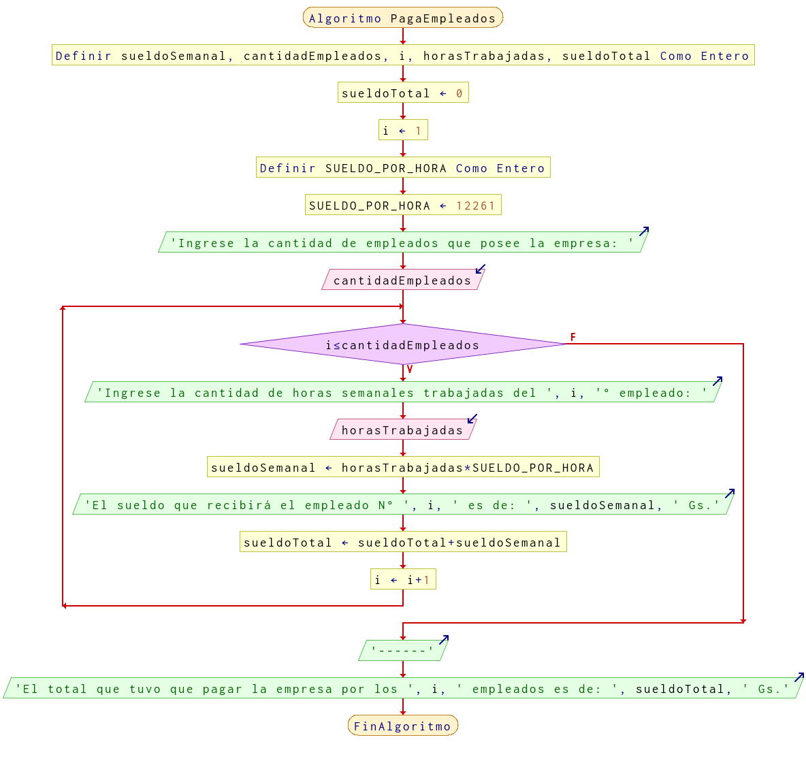

# Ejercicio 16 ciclos

## Planteamiento del problema

Una empresa les paga a sus empleados con base en las horas trabajadas en la semana. Realice un algoritmo para determinar el sueldo semanal de N trabajadores y, además, calcule cuánto pagó la empresa por los N empleados.

### Análisis

- **Datos de entrada:** La cantidad de empleados que posee la empresa, las horas trabajadas en la semana de cada empleado.
- **Datos de salida:** El sueldo semanal de cada uno de los empleados, y el sueldo total de todos los empleados que pagó la empresa.
- **Variables:** sueldoSemanal, cantidadEmpleados, i, horasTrabajadas, sueldoTotal: Numéricas Enteras.
- **Constantes:** SUELDO_POR_HORA: Numéricas Enteras.
- *Cálculos*:
```C
cantidadEmpleados = 5
i = 1
sueldoTotal = 0
SUELDO_POR_HORA = 12261 // GS.
horasTrabajadas = Lo que el usuario ingresará.
Mientras que i sea menor a cantidadEmpleados hacer:
    Lea(horasTrabajadas)
    sueldoSemanal = SUELDO_POR_HORA * horasTrabajadas
    Escriba(sueldoSemanal)
    sueldoTotal = sueldoTotal + sueldoSemanal
    i = i + 1
```

### Diseño

- Declarar las variables `sueldoSemanal`, `cantidadEmpleados`, `i`, `horasTrabajadas`, y `sueldoTotal` como numéricas enteras.
- Inicializar las variables en 0 y 1 el `sueldoTotal` y la `i` respectivamente.
- Declarar e inicializar la constante `SUELDO_POR_HORA` en 12261.
- Escribir por pantalla preguntando al usuario que ingrese la cantidad de empleados que desea ingresar.
- Asignar dicho dato en la variable `cantidadEmpleados`.
- Crear un bucle **MIENTRAS** que i sea menor o igual a la `cantidadEmpleados` realizar las siguientes operaciones.
- Escribir por pantalla que ingrese la cantidad de horas trabajadas del empleado N° `i`.
- Asignar dicho valor en la variable `horasTrabajadas`.
- A `sueldoSemanal` hay que asignarle la multiplicación de `horasTrabajadas` por `SUELDO_POR_HORA`.
- Escribir por pantalla que el empleado N° `i` recibe como pago el valor de `sueldoSemanal`.
- A `sueldoTotal` se le asigna la suma de `sueldoTotal` más `sueldoSemanal`.
- Por último, la variable `i` se le asigna más uno por ser un contador.
- El bucle finaliza cuando la `i` es mayor a la cantidad de empleados.
- Escribir por pantalla un separador para diferenciar del resto.
- Imprimir por pantalla el total que pagó la empresa por la cantidad de empleados ingresados.

## Diagrama de flujo


