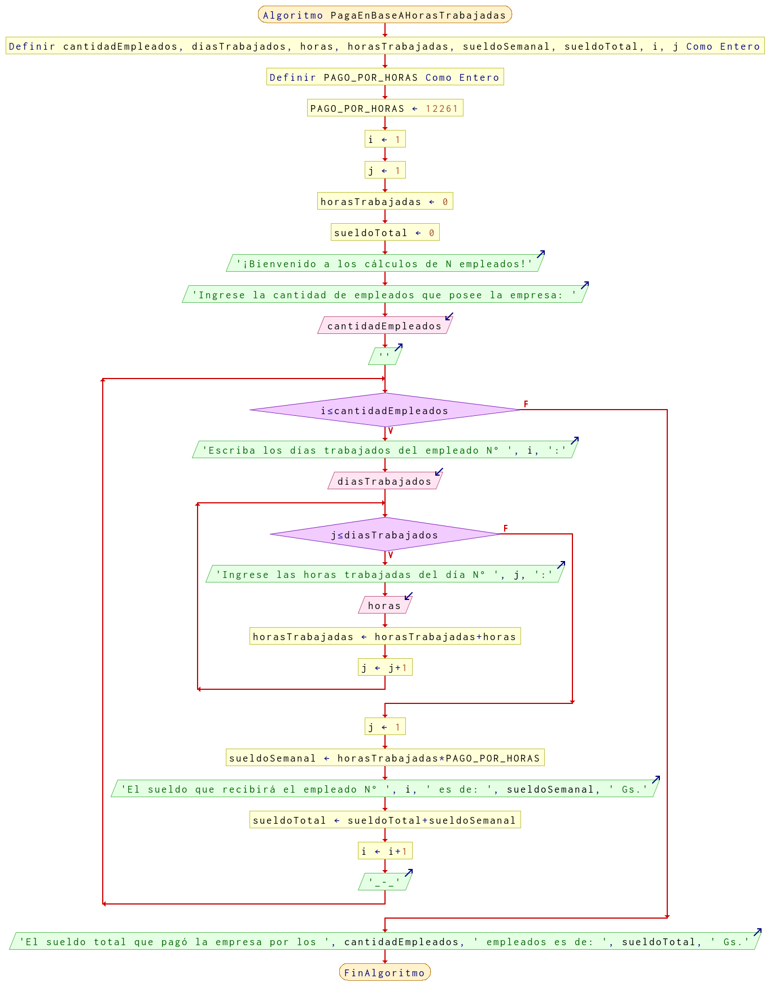

# Ejercicio 17 ciclos

## Planteamiento del problema

Una empresa les paga a sus empleados con base en las horas trabajadas en la semana. Para esto, se registran los días que trabajó y las horas de cada día. Realice un algoritmo para determinar el sueldo semanal de N trabajadores y además calcule cuánto pagó la empresa por los N empleados.

### Análisis

- **Datos de entrada:** Los días que trabajó, las horas de cada día trabajado, la cantidad de empleados que posee la empresa.
- **Datos de salida:** El sueldo semanal de cada trabajador, y la cantidad que pagó la empresa por los N trabajadores.
- **Variables:** cantidadEmpleados, diasTrabajados, horas, horasTrabajadas, sueldoSemanal, sueldoTotal, i, j: Numéricas Enteras.
- **Constantes:** PAGO_POR_HORAS: Numérica Entera.
- *Cálculos*:
```C
cantidadEmpleados = 0 // La cantidad que disponga el usuario.
diasTrabajados = 0 // La cantidad que disponga el usuario.
horasTrabajadas = 0 // Acumulador de horas.
PAGO_POR_HORAS = 12261 // Jornal por hora diurno.
i = 1 // Contador.
j = 1 // Otro contador.
sueldoTotal = 0 // Acumulador.
// Cálculo auxiliar.
Mientras i <= cantidadEmpleados
    Lea(diasTrabajados)
    Mientras j <= diasTrabajados
        Lea(horas)
        horasTrabajadas = horasTrabajadas + horas
        j = j + 1
    Fin(Mientras)
    j = 1
    sueldoSemanal = horasTrabajadas * PAGO_POR_HORAS
    Escriba(sueldoSemanal, i)
    sueldoTotal = sueldoTotal + sueldoSemanal
    i = i + 1
Fin(Mientras)
Escriba(sueldoTotal)
```

### Diseño

- Definir las variables `cantidadEmpleados`, `diasTrabajados`, `horas`, `horasTrabajadas`, `sueldoSemanal`, `sueldoTotal`, `i`, y `j` como numéricas enteras.
- Definir e inicializar una constante `PAGO_POR_HORAS` con el valor de 12261 como numérica entera.
- Inicializar las variables `i` y `j` con el valor de uno.
- Inicializar los acumuladores como son las `horasTrabajadas` y el `sueldoTotal` con los valores de cero respectivamente.
- Indicar al usuario el ingreso de la cantidad de empleados que posea la empresa y asignar dicho valor en la variable `cantidadEmpleados`.
- Colocar un ciclo **MIENTRAS** que `i` sea menor o igual a la `cantidadEmpleados` realizar las siguientes operaciones:
    - Indicar al usuario que debe ingresar los días trabajados del empleado seleccionado por `i` y asignar dicho valor en la variable `diasTrabajados`.
    - Crear otro ciclo **MIENTRAS** que `j` sea menor o igual a los `diasTrabajados`, podremos realizar las siguientes operaciones:
        - Indicar nuevamente al usuario, pero esta vez pidiendo las horas trabajadas del día seleccionado por `j` y asignar dicho valor en la variable `horas`.
        - Asignar `horasTrabajadas` la suma de `horasTrabajadas + horas`.
        - Contar más uno la variable `j`.
    - El ciclo **MIENTRAS** interno termina cuando la `j` es mayor que los días trabajados (`diasTrabajados`).
    - Reiniciamos el valor del contador `j` asignando `j = 1`.
    - Al `sueldoSemanal` se le asigna la multiplicación de: `horasTrabajadas * PAGO_POR_HORAS`.
    - Escribir por pantalla el sueldo que recibirá el empleado seleccionado por `i` en guaraníes.
    - Asignar `sueldoTotal` la suma de: `sueldoTotal + sueldoSemanal`.
    - Contar un más uno al contador `i`.
- El ciclo **MIENTRAS** termina cuando la `i` sea mayor a la `cantidadEmpleados`.
- Escribir por pantalla lo que pagó la empresa en cuestión de salarios mediante el valor de `sueldoTotal` en guaraníes.

## Diagrama de flujo


