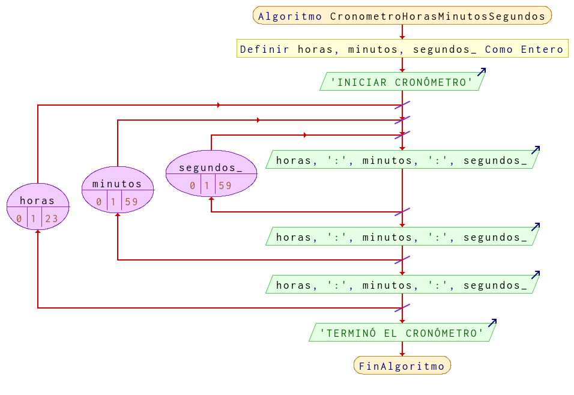

# Ejercicio 18 ciclos

## Planteamiento del problema

Hacer un programa que muestre un cronómetro, indicando las horas, minutos y segundos.

### Análisis

- **Datos de entrada:** Ningún dato de entrada.
- **Datos de salida:** Simulando un cronómetro desde cero hasta las horas, minutos, o segundos ingresados.
- **Variables:** horas, minutos, segundos: Numéricas Enteras.
- *Cálculos*:
```C
horas = 23           // Contador i desde cero para horas.
minutos = 59           // Contador j desde cero para minutos.
segundos = 59           // Contador k desde cero para segundos.
```

### Diseño

- Definir las variables `horas`, `minutos`, y `segundos`, como numéricas enteras.
- Crear un ciclo **PARA** (horas) `horas` desde 0 hasta 23 con variación más uno.
    Crear un ciclo **PARA** (minutos) `minutos` desde 0 hasta 59 con variación más uno.
        Creamos otro ciclo **PARA** (segundos) `segundos` desde 0 hasta 59 con variación más uno.
            - Escribir por pantalla el valor de `segundos` para los segundos.
            - Incrementar `segundos` en más uno una vez llegado al final del `Fin(Para)`.
        - Escribir por pantalla el valor de `minutos` para mostrar los minutos.
        - Incrementar `minutos` en más uno una vez llegado al final del `Fin(Para)`.
    - Escribir por pantalla el valor de `horas` para mostrar los minutos.
    - Incrementar `horas` en más uno una vez llegado al final del `Fin(Para)`.
- Una vez terminado todos los ciclos, terminar el programa con un mensaje "FIN DEL CRONÓMETRO".

## Diagrama de flujo


