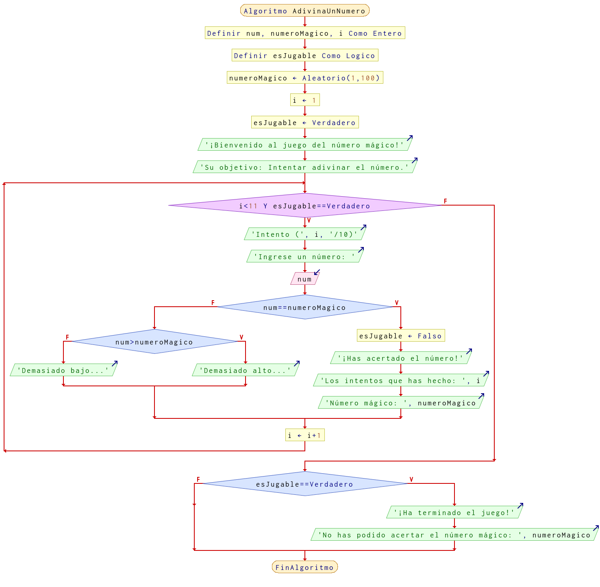

# Ejercicio 2 ciclos

## Planteamiento del problema

Crea una aplicación que permita adivinar un número. La aplicación genera un número aleatorio del 1 al 100. A continuación va pidiendo números y va respondiendo si el número a adivinar es mayor o menor que el introducido, además de los intentos que te quedan (tienes 10 intentos para acertarlo). El programa termina cuando se acierta el número (además te dice en cuantos intentos lo has acertado), si se llega al límite de intentos te muestra el número que había generado.

### Análisis

- **Datos de entrada:** Un número por cada ciclo.
- **Datos de salida:** La cantidad de intentos, el número que se ha generado, y un mensaje de que lo ha o no logrado.
- **Variables:** num, numeroMagico, i: Numéricas Enteras; esAcertado: Tipo Lógico.
- *Cálculos*:
```C
numeroMagico = Números aleatorios entre el uno y el cien.
num = Ingresado por el usuario.
Supongamos numeroMagico = 48;
esJugable = VERDADERO;
i = 1;
```

### Diseño

1. Asignar `numeroMagico` un valor inicial de aleatorio del 1 al 100.
2. Asignar `esAcertado` un valor de inicial de **FALSO**.
3. Asignar `i` un valor inicial de uno.
4. Iniciar un ciclo en donde la `i` sea menor a *11* y `esJugable` sea igual a **VERDADERO**.
5. Preguntar al usuario por un número.
6. Asignar dicho dato en `num`.
7. Si `num` es igual a `numeroMagico`. Si es **VERDADERO**, entonces `esJugable` es **FALSO** porque ya ganó y enviar un mensaje por pantalla que ganó con tantos intentos.
8. Caso contrario, si `num` es mayor a `numeroMagico`. Si es **VERDADERO** entonces `num` rebasa al `numeroMagico` y enviar un mensaje. Si es **FALSO**, entonces `num` no alcanza aún a `numeroMagico`.
9. Una vez que se salga del ciclo, es porque hay que verificar si `i` es mayor a 10. Si es **VERDADERO**, entonces quiere decir que no ha acertado ningún número y enviar un mensaje al usuario con el `numeroMagico`. Caso contrario, no hacer nada.

## Diagrama de flujo


