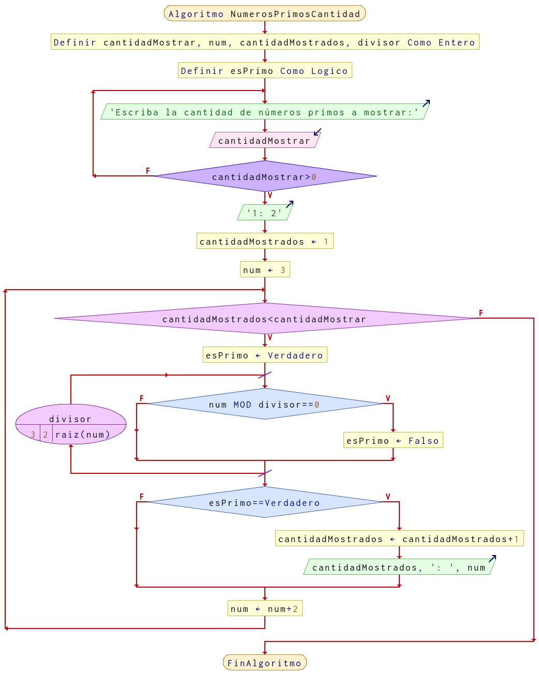

# Ejercicio 20 ciclos

## Planteamiento del problema

Mostrar en pantalla los N primero número primos. Se pide por teclado la cantidad de números primos que queremos mostrar.

### Análisis

- **Datos de entrada:** Ingresar la cantidad de números primos.
- **Datos de salida:** Mostrar los números primos desde dos hasta N.
- **Variables:** cantidadMostrar, num, cantidadMostrados, divisor: Numéricas Enteras; esPrimo: Como tipo Lógico.
- *Cálculos*:
```C
Leer la cantidad a mostrar. Evaluar si es que es cero o menos cero.
El primer número por defecto en ser primo es dos.
Ir realizando cada número hasta su raíz cuadrada.
```

### Diseño

- Declaramos las variables `cantidadMostrar`, `num`, `cantidadMostrados`, `divisor`: Como numéricas enteras.
- Declaramos la variable `esPrimo` como tipo lógico.
- Creamos un bucle de tipo **HAGA** en el cual tendrá las siguientes instrucciones, con la condición de que *NO* sea menor o igual a cero.
    - Escribimos por pantalla para que se ingrese la cantidad de números que se desea ingresar.
    - Leemos el dato y lo asignamos a la variable `cantidadMostrar`.
- Escribimos por pantalla el primer número primo por defecto que es el número dos (2).
- Asignamos las variables `cantidadMostrados` y `num` con `1` y `3` respectivamente.
- Instruyamos al bucle **MIENTRAS** con la condición de que la `cantidadMostrados` sea menor a la `cantidadMostrar`.
    - A la variable `esPrimo` asignar el valor lógico de **VERDADERO**.
    - Creamos un bucle **PARA** con `divisor` **DESDE** 3 **HASTA** la raíz cuadrada de `num` **CON VARIACIÓN** `+1`.
        - Se recorre el ciclo **PARA** e inmediatamente se evalúa **SI** `num` el módulo de la división con `divisor` es igual a cero, realizar:
            - Si es **VERDADERO** entonces a `esPrimo` asignar el valor lógico de **FALSO**.
            - Si es **FALSO** no hacer nada y obviar el componente opción de **SINO** o **DE LO CONTRARIO**.
        - Al llegar al final del **PARA** "Fin(Para)", a `divisor` sumar más dos por la variación de `+2`.
    - Creamos un bucle **SI** en el cual se evalúa si `esPrimo` es igual a **VERDADERO**.
        - Si es **VERDADERO** entonces a `cantidadMostrados` asignar `cantidadMostrados` más un uno y escribimos por pantalla el siguiente formato: `cantidadMostrados, ": ",  num`.
        - Si es **FALSO**, no haga nada.
    - A `num` asignar la suma de `num` más un dos.
- Fin del bucle **MIENTRAS** y, por ende, fin del algoritmo.

## Diagrama de flujo


