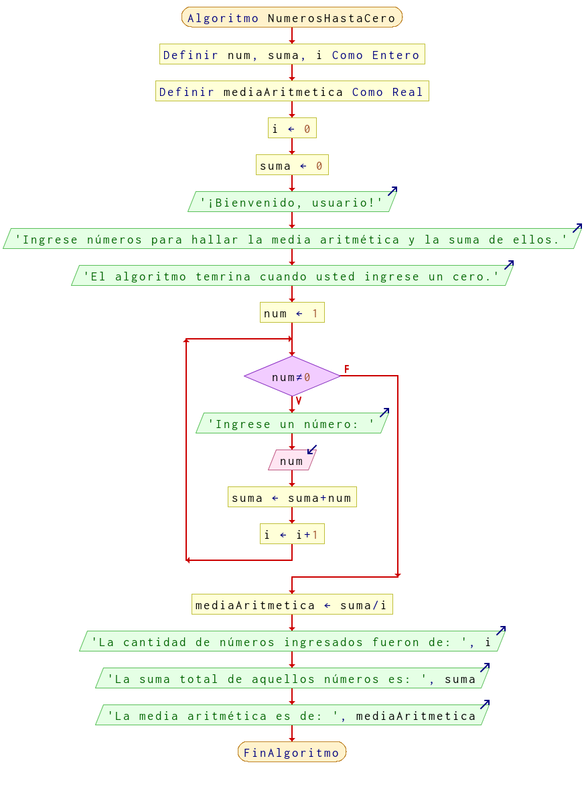

# Ejercicio 3 ciclos

## Planteamiento del problema

Algoritmo que pida números hasta que se introduzca un cero. Debe imprimir la suma y la media de todos los números introducidos.

### Análisis

- **Datos de entrada:** Números introducidos.
- **Datos de salida:** Suma y la media aritmética de esos números introducidos.
- **Variables:** num, suma, i: Numéricas Enteras; mediaAritmetica: Numérica Real.
- *Cálculos*:
```C
suma = 0
suma = suma + num
media = suma / cantidad de números introducidos
```

### Diseño

1. Asignar la `i` como 1.
2. Asignar la `suma` como 0.
3. Imprimir por pantalla la bienvenida del algoritmo.
4. Asignar `num` como 1.
5. Iniciar un bucle mientras que `num` sea distinto a cero.
6. Imprimir por pantalla al usuario que introduzca un número.
7. El número introducido asignarlo en la variable `num`.
8. La `suma` asignar la `suma` sumando con la variable `num`.
9. La `i` se incrementa en más uno.
10. Terminado el ciclo, podemos asignar `mediaAritmetica` la división entre `suma` por `i`.
11. Imprimir los resultados por consola.

## Diagrama de flujo


