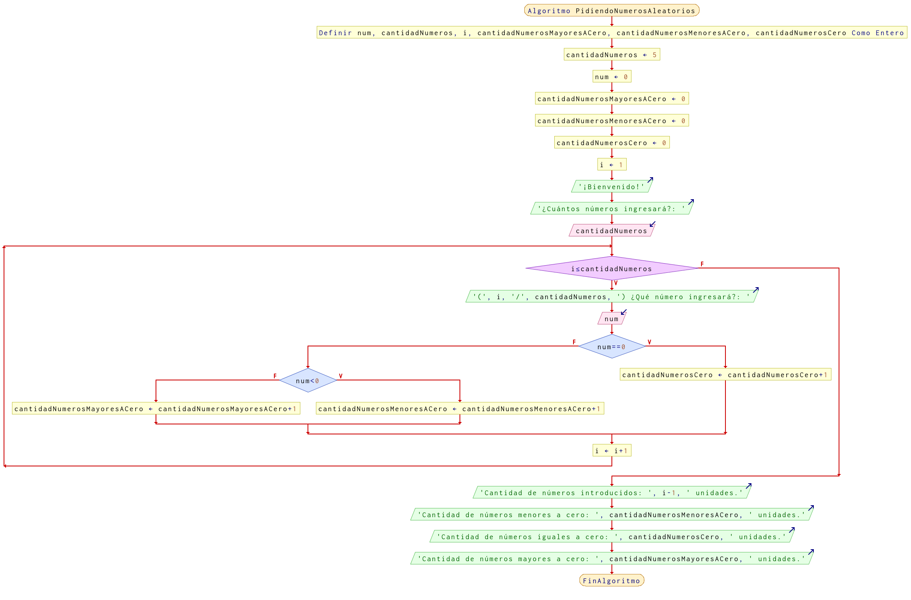

# Ejercicio 4 ciclos

## Planteamiento del problema

Realizar un algoritmo que pida números (se pedirá por teclado la cantidad de números a introducir). El programa debe informar de cuantos números introducidos son mayores que 0, menores que 0 e iguales a 0.

### Análisis

- **Datos de entrada:** Cantidad de números deseados a introducir, números ingresados por teclado.
- **Datos de salida:** Cantidad de números ingresados son mayores de cero, cantidad de números ingresados son menores de cero, y cantidad de números que son iguales a cero.
- **Variables:** num, cantidadNumeros, i, cantidadNumerosMayoresACero, cantidadNumerosMenoresACero, cantidadNumerosCero: Numéricas Enteras.
- *Cálculos*:
```C
i = 1
cantidadNumeros = Lo que desee el usuario. Es el límite.
num = El número que desee el usuario.
Siempre en condición para saber si un número es mayor a cero, menor a cero, o igual a cero.
```

### Diseño

1. A `cantidadNumeros` se le asigna un 5 por defecto.
2. A `num` se le asigna un 0 por defecto.
3. A las demás variables, `cantidadNumerosMayoresACero`, `cantidadNumerosMenoresACero`, y `cantidadNumerosCero` se le definen un cero por defecto.
4. A la variable `i` se le asigna un 1 por defecto.
5. Preguntar al usuario cuántos números ingresará y asignarlos en la variable `cantidadNumeros`.
6. Mientras que `i` sea menor o igual a `cantidadNumeros`, realizar las operaciones correspondientes.
7. Preguntar por un número mediante por teclado al usuario y asignarlo en la variable `num`.
8. Verificamos si `num` es igual a cero, si es **VERDADERO** entonces contamos más uno en `cantidadNumerosCero`.
9. Si es **FALSO**, entonces hay que verificar si `num` es menor que cero. Si es **VERDADERO**, entonces contamos más uno `cantidadNumerosMenoresACero`.
10. Si es **FALSO**, entonces al fin y al cabo es mayor que cero el valor de `num` y contar más uno el valor de `cantidadNumerosMayoresACero`.
11. Imprimir por pantalla la cantidad de números ingresados.
12. Escribir por pantalla la cantidad de números menores a cero.
13. Escribir por pantalla la cantidad de números igual es a cero.
14. Escribir por pantalla la cantidad de números mayores a cero.

## Diagrama de flujo


