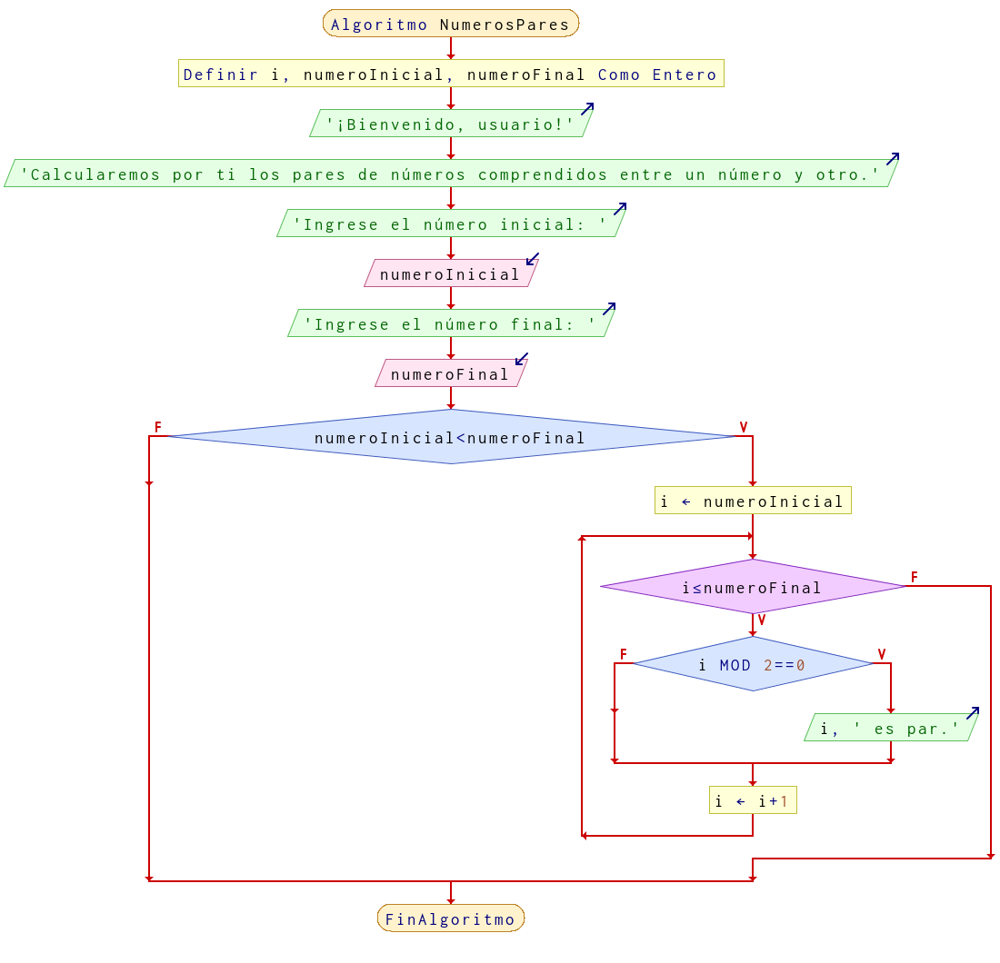

# Ejercicio 6 ciclos

## Planteamiento del problema

Escribir un programa que imprima todos los números pares entre dos números que se le pidan al usuario.

### Análisis

- **Datos de entrada:** Dos números ingresados por el usuario.
- **Datos de salida:** Todos los números pares comprendidos entre los dos números ingresados por el usuario.
- **Variables:** numeroInicial, numeroFinal, i: Numéricas Enteras.
- *Cálculos*:
```C
numeroInicial y numeroFinal serán los dos números comprendidos.
i es el número contador que será de evaluación.
```

### Diseño

- Mostrar mensajes de bienvenida al usuario.
- Pedir al usuario el número inicial y asignarlo en `numeroInicial`.
- Pedir al usuario el número final y asignarlo en `numeroFinal`.
- Verificar si el número inicial es menor al numero final. Si es **VERDADERO**, se realizarán las operaciones, si es **FALSO** se terminará el algoritmo.
- Asignar la `i` con el valor de `numeroInicial`.
- Ejecutar un ciclo mientras que la `i` sea menor o igual a `numeroFinal` se realizarán las operaciones correspondientes.
- Se verificará si la `i` módulo dos es igual a cero. Si es **VERDADERO**, se mostrará por pantalla que el número `i` es par, si es **FALSO** no mostrará nada.
- Incrementar `i` más uno con cada iteración.

## Diagrama de flujo


