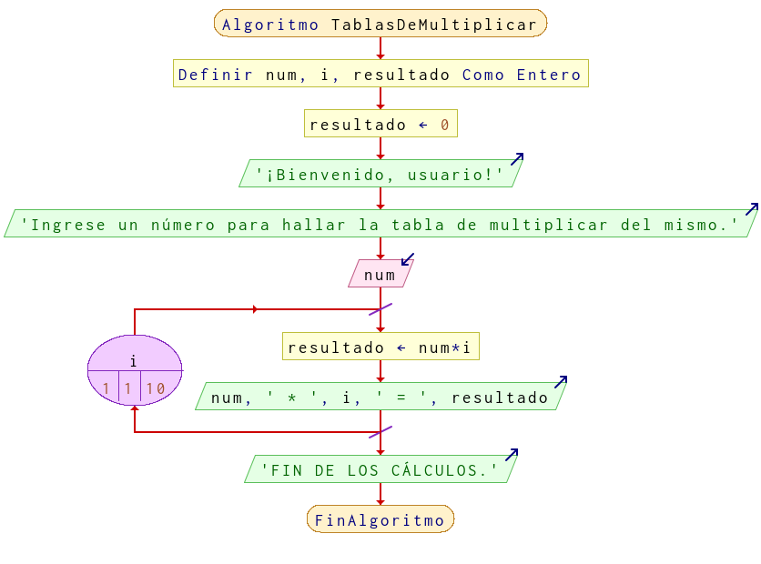

# Ejercicio 7 ciclos

## Planteamiento del problema

Realizar una algoritmo que muestre la tabla de multiplicar de un número introducido por teclado.

### Análisis

- **Datos de entrada:** Número entero introducido por el usuario.
- **Datos de salida:** La tabla de multiplicar de ese número del 1 al 10.
- **Variables:** num, i, resultado: Numéricas Enteras.
- *Cálculos*:
```C
num = 2: Valor introducido por el usuario.
i = 1: El contador.
resultado = 0: El resultado del producto entre num e i.
resultado = num * i
```

### Diseño

- Asignar la variable `resultado` a cero.
- Preguntar al usuario el número que desea desplegar para la tabla de multiplicar.
- Asignar dicho dato en la variable `num`.
- Usar un ciclo *PARA* que `i` sea 1 hasta que sea 10 con variación más uno, entonces se realizarán las siguientes operaciones.
- A `resultado` asígnele el producto de `i` por `num`.
- Escribir por pantalla el siguiente formato: `num * i = resultado`.
- En variable `i` asignar el incremento de más uno.
- Escribir al final del algoritmo el mensaje "FIN DE LOS CÁLCULOS.".

## Diagrama de flujo


