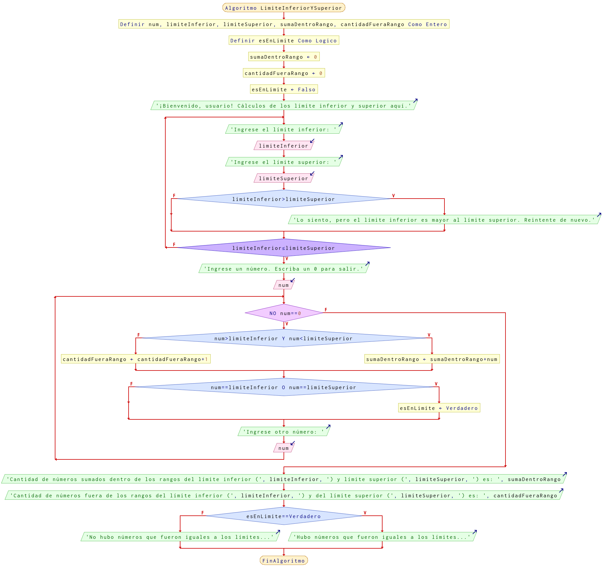

# Ejercicio 8 ciclos

## Planteamiento del problema

Escribe un programa que pida el limite inferior y superior de un intervalo. Si el límite inferior es mayor que el superior lo tiene que volver a pedir. A continuación se van introduciendo números hasta que introduzcamos el 0. Cuando termine el programa dará las siguientes informaciones:
- La suma de los números que están dentro del intervalo (intervalo abierto).
- Cuántos números están fuera del intervalo.
- He informa si hemos introducido algún número igual a los límites del intervalo.

### Análisis

- **Datos de entrada:** El límite inferior, el límite superior, y los números introducidos.
- **Datos de salida:** La suma de los números que están dentro de los límites, el contador de los números que están fuera de los límites, y si hubo algún número que fue igual a los límites.
- **Variables:** num, limiteInferior, limiteSuperior, sumaDentroRango, cantidadFueraRango: Numéricas Enteras; esEnLimite: Valor Lógico.
- *Cálculos*:
```C
limiteInferior, limiteSuperior: Son ingresados por el usuario.
Ingresar números en num.
Verificar si num == limiteInferior OR num == limiteSuperior
esEnLimite = VERDAD
O sino num > limiteInferior AND num < limiteSuperior
sumaDentroRango = sumaDentroRango + num
O al final num no está simplemente en el intervalo.
cantidadFueraRango = cantidadFueraRango + 1
```

### Diseño

- Asignar `sumaDentroRango` como cero por defecto.
- Asignar `cantidadFueraRango` como cero por defecto.
- Asignar `esEnLimite` como **FALSO**.
- Realizar con un **HAGA** con las instrucciones de inserción de los intervalos inferior y superior.
- Asignar los valores en `limiteInferior` y `limiteSuperior` respectivamente.
- Verificar si el `limiteInferior` es mayor a `limiteSuperior`, entonces hay que pedirle nuevamente la inserción al usuario.
- La instrucción del **HAGA** termina cuando el límite inferior es menor o igual al límite superior.
- Escribimos por pantalla pidiendo al usuario que ingrese un número.
- Asignamos el número ingresado a `num`.
- Creamos una instrucción **MIENTRAS** que `num` sea no igual a cero, hacemos las instrucciones correspondientes.
- Verificamos que `num` sea mayor que el límite inferior y menor que el límite superior, entonces sería que `num` está dentro de los rangos.
- Si no pertenece al rango establecido, entonces contamos más uno `cantidadFueraRango`.
- Si al final el número es igual a los límites, `num` igual a `limiteInferior` o igual a `limiteSuperior`, entonces podemos decir que ese número ingresado estuvo igual a los límites.
- Volvemos a preguntar que ingrese un número.
- Asignamos nuevamente el valor dentro de la variable `num`.
- El ciclo termina cuando `num` es igual a cero.
- Terminado el ciclo, escribimos los resultados de la `sumaDentroRango` y `cantidadFueraRango`.
- Verificamos si `esEnLimite` es verdadero para mostrar como resultado en pantalla que algún número fue igual a los límites.
- Caso contrario, mostrar un mensaje de que ningún número fue igual a los límites.

## Diagrama de flujo


