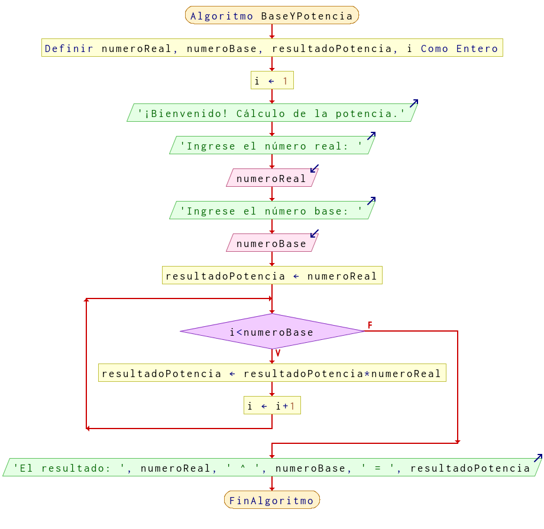

# Ejercicio 9 ciclos

## Planteamiento del problema

Escribe un programa que dados dos números, uno real (base) y un entero positivo (exponente), saque por pantalla el resultado de la potencia. No se puede utilizar el operador de potencia.

### Análisis

- **Datos de entrada:** Un número real, un número entero.
- **Datos de salida:** La potencia del número real con el número entero ingresado.
- **Variables:** numeroReal, numeroBase, resultadoPotencia, i: Numéricas Enteras.
- *Cálculos*:
```C
numeroReal = 2;
numeroBase = 5;
resultadoPotencia = numeroReal; Es un acumulador.
La potencia tiene que seguir este patrón:
2 * 2 * 2 * 2 * 2 = 32
numeroReal * numeroReal * numeroReal * numeroReal * numeroReal = resultadoPotencia
```

### Diseño

- Declaración de variables `numeroReal`, `numeroBase`, `resultadoPotencia`, e `i` como enteras.
- Inicialización de la variable `i` en uno.
- Pedir al usuario que ingrese datos para los valores de `numeroReal` y `numeroBase`.
- Inicialización de la variable `resultadoPotencia` con el valor ingresado de la variable `numeroReal`.
- Realizar un ciclo **MIENTRAS** que `i` sea menor a `numeroBase` hacer las instrucciones correspondientes.
- Al `resultadoPotencia` asignar el producto de `resultadoPotencia` con `numeroReal`.
- El contador `i` asignar un más uno.
- El ciclo termina cuando `i` sea mayor o igual al `numeroBase`.
- Escribir el resultado con un formato similar a este ejemplo: `2 ^ 5 = 32`.

## Diagrama de flujo


