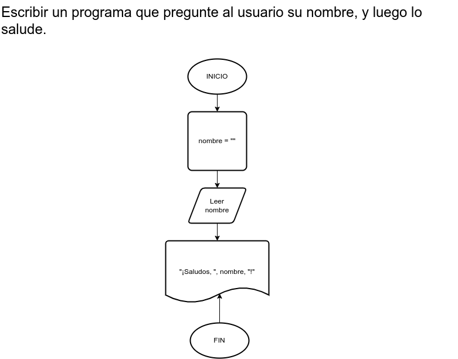

# Ejercicio 1

## Planteamiento del problema

Escribir un programa que pregunte al usuario su nombre, y luego lo salude.

### Análisis

- Datos de entrada: Nombre del usuario.
- Datos de salida: Un mensaje de saludo con el nombre del usuario.
- Variables: nombre (carácter)
- Cálculos: Simplemente concatenar el mensaje "¡Saludos, " + nombre + "!"

### Diseño

1. Pedir que ingrese su nombre.
2. Asignar ese ingreso de dato a la variable *nombre*.
3. Escribir por pantalla el mensaje "¡Saludos, *nombre*!" En donde *nombre* es el nombre del usuario. 

## Diagrama de flujo

