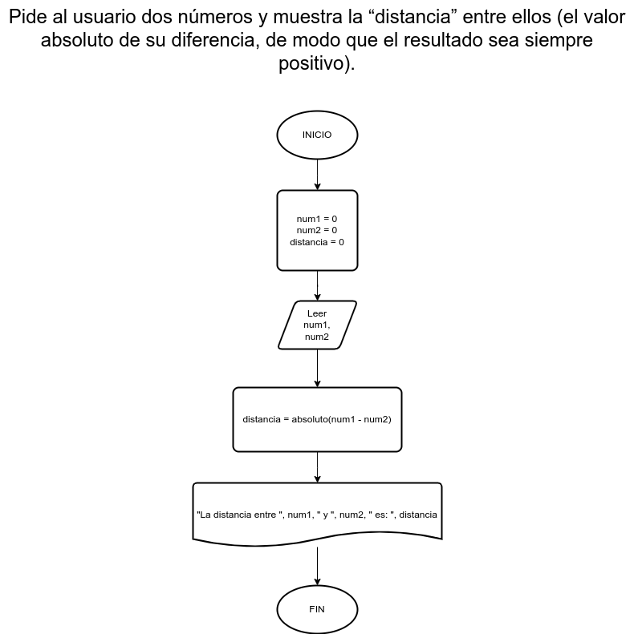

# Ejercicio 11

## Planteamiento del problema

Pide al usuario dos números y muestra la "distancia" entre ellos (el valor absoluto de su diferencia, de modo que el resultado sea siempre positivo).

### Análisis

- **Datos de entrada:** Dos números enteros.
- **Datos de salida:** La distancia (valor absoluto) entre esos dos números.
- **Variables:** num1, num2, distancia: Numéricas Enteras.
- _Cálculos:_
```C
distancia = absoluto(num1 - num2)
```

### Diseño

1. Ingresar dos números enteros.
2. Asignar esos dos números enteros en las variables *num1* y *num2*.
3. Realizar la diferencia entre *num1* y *num2*.
4. Asignar en la variable *distancia* el resultado con su valor absoluto.

## Diagrama de flujo


