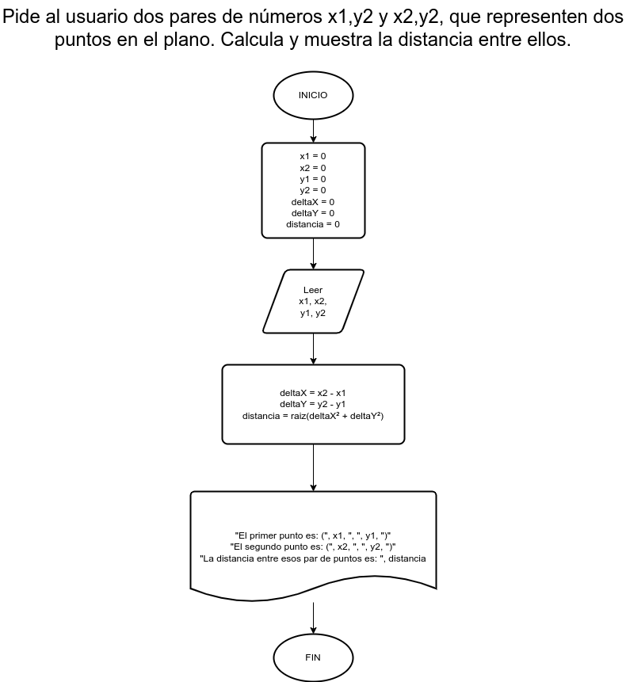

# Ejercicio 12

## Planteamiento del problema

Pide al usuario dos pares de números x1,y1 y x2,y2, que representen dos puntos en el plano. Calcula y muestra la distancia entre ellos.

### Análisis

- **Datos de entrada:** Dos pares de números.
- **Datos de salida:** La distancia entre esos dos pares de puntos.
- **Variables:** x1, x2, y1, y2, distancia, deltaX, deltaY: Numéricas Reales.
- _Cálculos:_
```C
deltaX = x2 - x1
deltaY = y2 - y1
distancia = raiz(deltaX² + deltaY²)
```

### Diseño

1. Ingresamos los valores para $x1$ y $x2$.
2. Asignamos dichos valores en las variables *x1* y *x2*.
3. Realizamos la diferencia entre *x2* y *x1*.
4. El resultado de la diferencia asignamos a la variable *deltaX* ($\Delta x$)
5. Ingresamos los valores para $y1$ y $y2$.
6. Asignamos dichos valores en las variables *y1* y *y2*.
7. Realizamos la diferencia entre *y2* y *y1*.
8. El resultado de la diferencia asignamos a la variable *deltaY* ($\Delta y$)
9. Hallamos la distancia asignando la raíz cuadrada de la suma de las potencias de *deltaX* y *deltaY*.
10. La distancia se ha hallado.

## Diagrama de flujo


