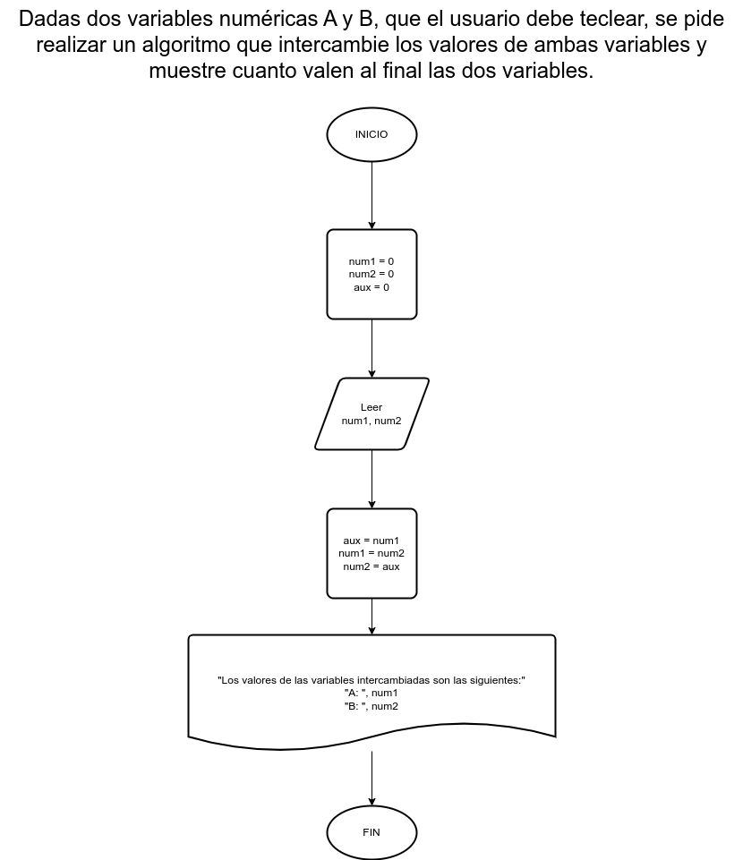

# Ejercicio 15

## Planteamiento del problema

Dadas dos variables numéricas A y B, que el usuario debe teclear, se pide realizar un algoritmo que intercambie los valores de ambas variables y muestre cuanto valen al final las dos variables.

### Análisis

- **Datos de entrada:** Dos números.
- **Datos de salida:** Los dos números intercambiados.
- **Variables:** num1, num2, aux: Numéricas Enteras
- _Cálculos:_
```C
num1 = 3 // Ejemplo...
num2 = 2 // Ejemplo...
aux = num1 // Valor de => 3.
num1 = num2 // El valor de 3 reemplazado por 2.
num2 = aux // El valor de 2 reemplazado por 3.
```

### Diseño

1. Ingresar dos números enteros.
2. Asignar dichos números en las variables *num1* y *num2* respectivamente.
3. Asignar el *num1* en la variable *aux*.
4. Asignar el *num2* en la variable *num1*.
5. Asignar, finalmente, el *aux* en el *num2*.
6. Escribir los resultados ya intercambiados.

## Diagrama de flujo


