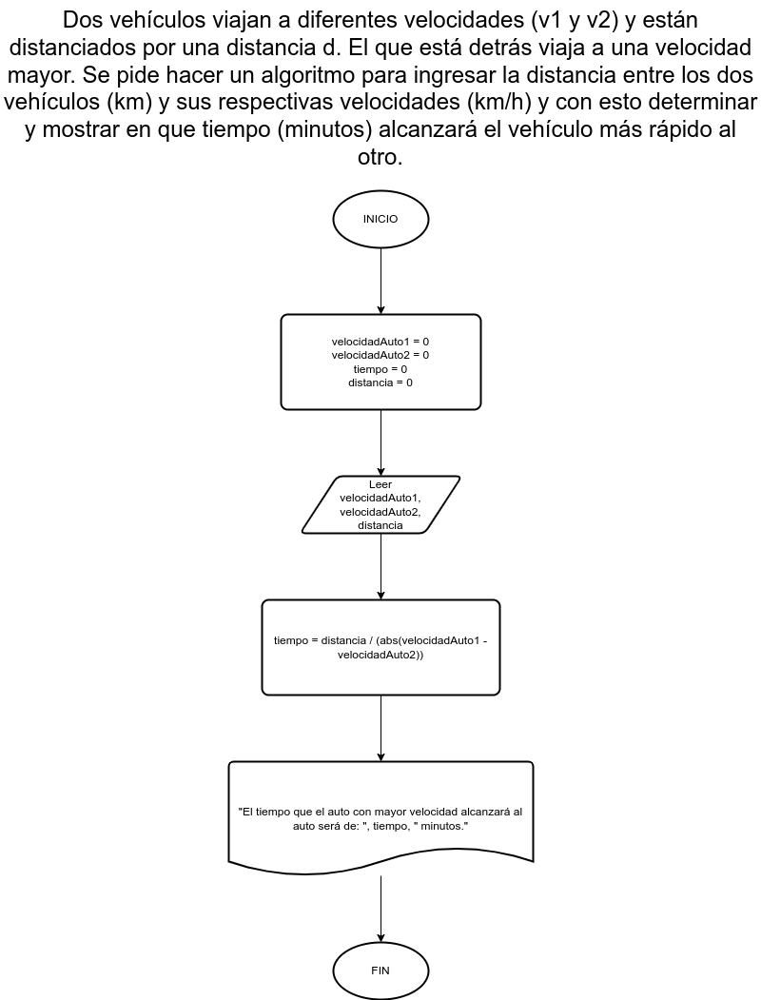

# Ejercicio 16

## Planteamiento del problema

Dos vehículos viajan a diferentes velocidades (v1 y v2) y están distanciados por una distancia d. El que está detrás viaja a una velocidad mayor. Se pide hacer un algoritmo para ingresar la distancia entre los dos vehículos (km) y sus respectivas velocidades (km/h) y con esto determinar y mostrar en que tiempo (minutos) alcanzará el vehículo más rápido al otro.

### Análisis

- **Datos de entrada:** Las velocidades de los dos vehículos en km/h y la distancia entre los dos vehículos en km.
- **Datos de salida:** El tiempo que alcanzará el vehículo con mayor velocidad.
- **Variables:** velocidadAuto1, velocidadAuto2, distancia, tiempo: Numéricas Reales.
- _Cálculos:_
```C
velocidadAuto1 = 15 // 15 Km/h...
velocidadAuto2 = 25 // 25 Km/h...
distancia = 2 // 2 Km...
tiempo = distancia / (abs(velocidadAuto1 - velocidadAuto2))
```

### Diseño

1. Ingresar las dos velocidades expresadas en km/h.
2. Asignar las dos velocidades en las variables *velocidadAuto1* y *velocidadAuto2*.
3. Ingresar la distancia expresada en km.
4. Asignar la distancia en la variable *distancia*.
5. Hallar el tiempo mediante la división entre la *distancia* y las restas de las velocidades.
6. Escribir el tiempo expresados en minutos.

## Diagrama de flujo


