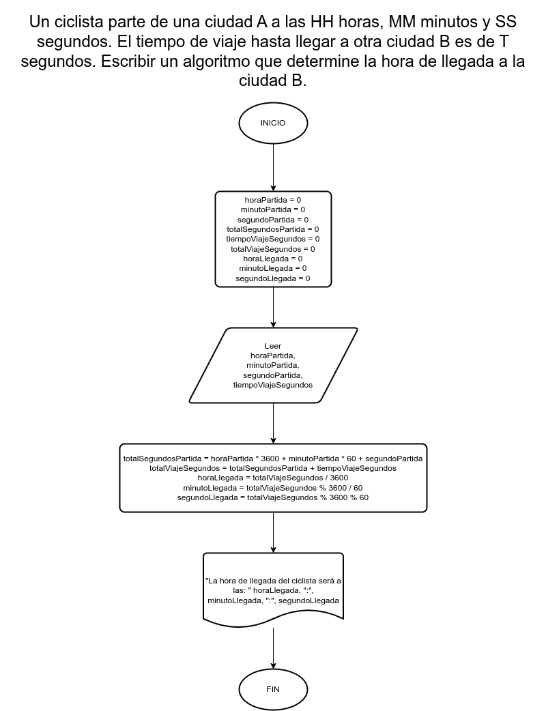

# Ejercicio 17

## Planteamiento del problema

Un ciclista parte de una ciudad A a las HH horas, MM minutos y SS segundos. El tiempo de viaje hasta llegar a otra ciudad B es de T segundos. Escribir un algoritmo que determine la hora de llegada a la ciudad B.

### Análisis

- **Datos de entrada:** La hora, minuto, y segundo en el cual el ciclista parte, y los segundos en que se tarda en viajar hasta la ciudad B.
- **Datos de salida:** La hora, minuto, y segundo de llegada del ciclista.
- **Variables:** horaParte, minutoParte, segundoParte, totalSegundosPartida, tiempoViajeSegundos, totalViajeSegundos, horaLlegada, minutoLlegada, segundoLlegada 
- _Cálculos:_
```C
horaParte = 17 // 17 HORAS.
minutoParte = 15 // 15 MINUTOS.
segundoParte = 45 // 45 SEGUNDOS.
// 17:15:45 PM...
totalSegundosPartida = (horaParte * 3600) + (minutoParte * 60) + segundoParte
// El valor de totalSegundosPartida es de -> 62145 segundos.
tiempoViajeSegundos = 70000 // Ejemplo, 70.000 segundos.
totalViajeSegundos = tiempoViajeSegundos + totalSegundosPartida
// El valor de totalViajeSegundos es de | 7855 |
horaLlegada = totalViajeSegundos / 3600
minutoLlegada = totalViajeSegundos % 3600 / 60
segundoLlegada = totalViajeSegundos % 3600 % 60
```

### Diseño

1. Leer las horas, minutos, y segundos de la partida.
2. Asignar dichos datos en las variables *horaParte*, *minutoParte*, y *segundoParte*.
3. Pasar las horas, minutos, y segundos, a solamente segundos.
4. Asignar el resultado en la variable *totalSegundosPartida*.
5. Leer el tiempo de viaje en segundos.
6. Asignar dicho valor en la variable *tiempoViajeSegundos*.
7. Hallar el total del viaje con la suma de *tiempoViajeSegundos* más *totalSegundosPartida*.
8. Guardar dicho valor en la variable *totalViajeSegundos*.
9. Hallamos la hora de llegada.
10. Asignamos la división de *totalViajeSegundos* con 3600 en la variable *horaLlegada*.
11. Asignamos el módulo de *totalViajeSegundos* con 3600 y la división con 60, en la variable *minutoLlegada*.
12. Asignamos el módulo de *totalViajeSegundos* con 3600 y el módulo con 60, en la variable *segundoLlegada*.
13. Escribimos el resultado en un correcto formato de HH:MM:SS.

## Diagrama de flujo


