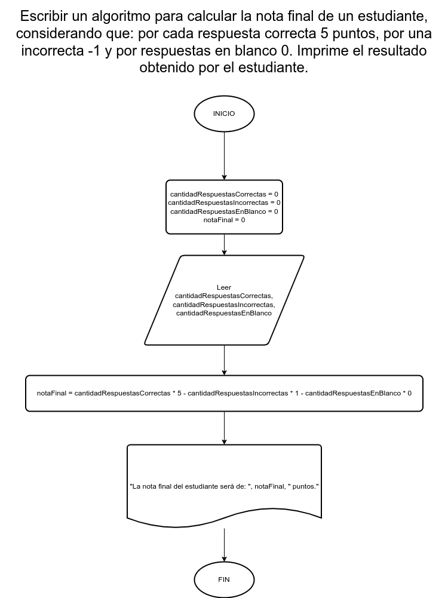

# Ejercicio 19

## Planteamiento del problema

Escribir un algoritmo para calcular la nota final de un estudiante, considerando que: por cada respuesta correcta 5 puntos, por una incorrecta -1 y por respuestas en blanco 0. Imprime el resultado obtenido por el estudiante.

### Análisis

- **Datos de entrada:** Cantidad de respuestas correctas, cantidad de respuestas incorrectas, y cantidad de respuestas en blanco.
- **Datos de salida:** La nota final del estudiante en base a las respuestas que realizó.
- **Variables:** cantidadRespuestasCorrectas, cantidadRespuestasIncorrectas, cantidadRespuestasEnBlanco, notaFinal: Numéricas Enteras.
- _Cálculos:_
```C
// El examen, ejemplo, es de 10 puntos en total.
cantidadRespuestasCorrectas = 7
cantidadRespuestasIncorrectas = 1
cantidadRespuestasEnBlanco = 2
notaFinal = cantidadRespuestasCorrectas * 5 - cantidadRespuestasIncorrectas * 1 - cantidadRespuestasBlanco * 0
```

### Diseño

1. Leer el valor para las cantidades de respuestas correctas.
2. Asignar dicho valor en la variable *cantidadRespuestasCorrectas*.
3. Leer el valor para las cantidades de respuestas incorrectas.
4. Asignar dicho valor en la variable *cantidadRespuestasIncorrectas*.
5. Leer el valor para las cantidades de respuestas en blanco.
6. Asignar dicho valor en la variable *cantidadRespuestasEnBlanco*.
7. Calcular la nota final mediante la siguiente ecuación: `nota = correctas * 5 - incorrectas * 1 - en\_blanco * 0`.
8. Asignar ese cálculo en la variable *notaFinal*.
9. Escribir el resultado de la nota final.

## Diagrama de flujo


