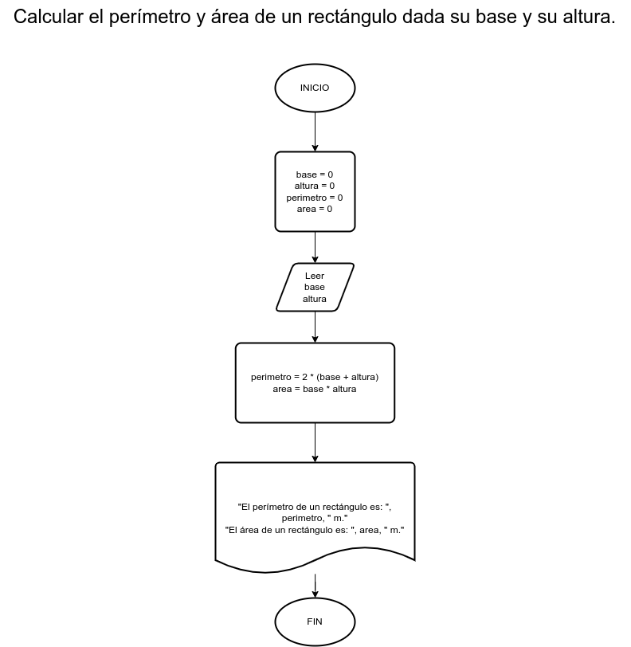

# Ejercicio 2

## Planteamiento del problema

Calcular el perímetro y área de un rectángulo dada su base y su altura.

### Análisis

- Datos de entrada: Base y altura.
- Datos de salida: Perímetro y el área.
- Variables: base, altura, perimetro, area. Todas numéricas reales. 
- Cálculos: perimetro = 2 * (base + altura) ; area = altura * base

### Diseño

1. Ingresar datos en las variables *base* y *altura*.
2. Calcular el *perímetro*.
3. Asignar los resultados en *perímetro*.
4. Calcular el *área*.
5. Asignar los resultados en *área*.
6. Escribir los resultados de *perímetro* y *área*.

## Diagrama de flujo

  
