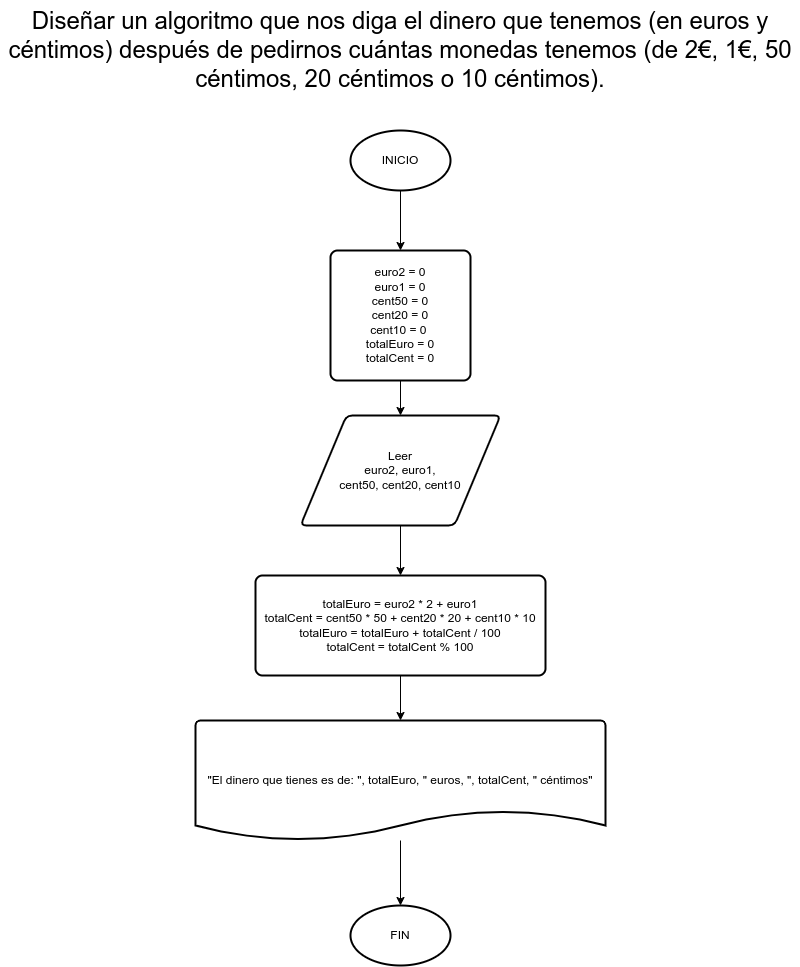

# Ejercicio 20

## Planteamiento del problema

Diseñar un algoritmo que nos diga el dinero que tenemos (en euros y céntimos) después de pedirnos cuantas monedas tenemos (de 2€, 1€, 50 céntimos, 20 céntimos o 10 céntimos).

### Análisis

- **Datos de entrada:** Monedas de 2 euros, 1 euro, 50 céntimos, 20 céntimos, y/o 10 céntimos.
- **Datos de salida:** Mostrar en euros y céntimos (la totalidad)
- **Variables:** euro2, euro1, cent50, cent20, cent10, totalEuro, totalCent: Numéricas Enteras.

### Diseño

1. Ingresar las monedas de 2, 1, 50 céntimos, 20 céntimos, o de 10 céntimos.
2. Asignar los valores existentes en sus respectivas variables.
3. Calcular los euros mediante la siguiente ecuación: `euros = euro2 * 2 + euro1`.
4. Asignar dicho cálculo del euro en la variable *totalEuro*.
5. Calcular los céntimos mediante la siguiente ecuación: `centimos = cent50 * 50 + cent20 * 20 + cent10 * 10`.
6. Asignar dicho cálculo del céntimo en la variable *totalCent*.
7. Realizar una conversión reasignando en la variable *totalEuro* la siguiente ecuación: `totalEuro = totalEuro + (totalCent / 100)`.
8. Realizar una conversión reasignando en la variable *totalCent* la siguiente ecuación: `totalCent = totalCent % 100`.
9. Escribir el resultado de *totalEuro* y *totalCent* por pantalla.

## Diagrama de flujo

