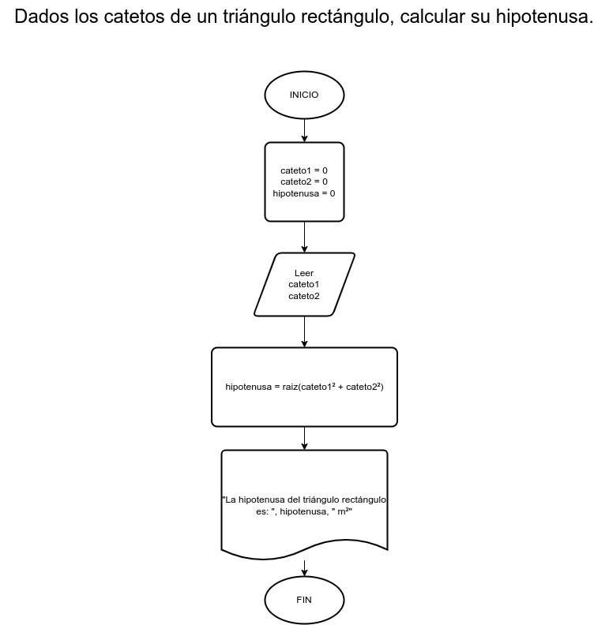

# Ejercicio 3

## Planteamiento del problema

Dados los catetos de un triángulo rectángulo, calcular su hipotenusa.

### Análisis

- Datos de entrada: Dos catetos.
- Datos de salida: La hipotenusa.
- Variables: cateto1, cateto2, hipotenusa: Numéricas reales.
- Cálculos: Para hallar la hipotenusa del triángulo rectángulo, se realizar el siguiente cálculo: hipotenusa = raiz(cateto1² + cateto2²)

### Diseño

1. Ingresamos datos en las variables *cateto1* y *cateto2*.
2. Realizamos los cálculos visualizados.
3. Asignamos esos cálculos resultantes en la variable *hipotenusa*.
4. Escribimos el resultado de la variable *hipotenusa*.

## Diagrama de flujo

  
