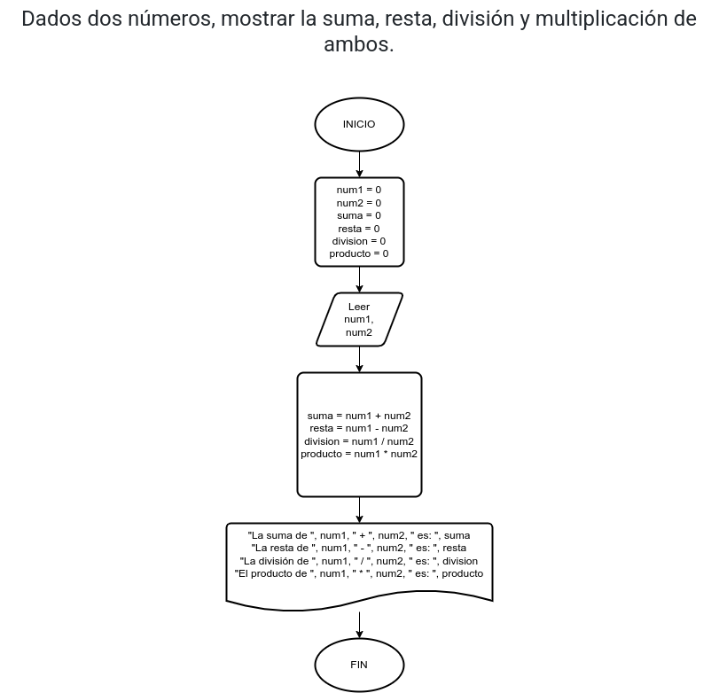

# Ejercicio 4

## Planteamiento del problema

Dados dos números, mostrar la suma, resta, división y multiplicación de ambos.

### Análisis

- Datos de entrada: Dos números reales
- Datos de salida: La suma, resta, división, y multiplicación de esos números. 
- Variables: num1, num2, suma, resta, division, producto: Numéricas reales 
- Cálculos: 
            ```c
            suma = num1 + num2
            resta = num1 - num2
            division = num1 / num2
            producto = num1 * num2
            ```

### Diseño

1. Ingresar por teclado dos números.
2. Asignar esos dos números en las variables *num1* y *num2* respectivamente.
3. Realizar la *suma* de esos dos números.
4. Realizar la *resta* de esos dos números.
5. Realizar la *division* de esos dos números.
6. Realizar el *producto* de esos dos números.
7. Escribir por pantalla la *suma*, la *resta*, la *division*, y el *producto*.

## Diagrama de flujo

 
