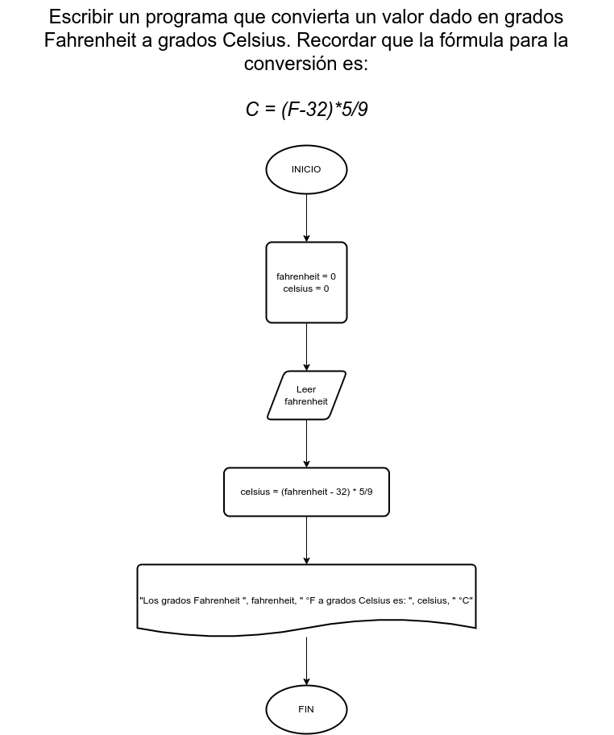

# Ejercicio 5

## Planteamiento del problema

Escribir un programa que convierta un valor dado en grados Fahrenheit a grados Celsius. Recordar que la fórmula para la conversión es: `C = (F-32)*5/9`

### Análisis

- Datos de entrada: Temperatura expresada en Fahrenheit.
- Datos de salida: Temperatura convertida y expresada en Celsius.
- Variables: fahrenheit, celsius: Numéricas Reales.
- Cálculos: `celsius = (fahrenheit - 32) * 5/9`

### Diseño

1. Ingresamos datos para almacenarlos en *fahrenheit*.
2. Realizamos el cálculo para convertirlo a Celsius con `celsius = (fahrenheit - 32) * 5/9`. 
3. Escribimos por pantalla el resultado de *celsius*.

## Diagrama de flujo

