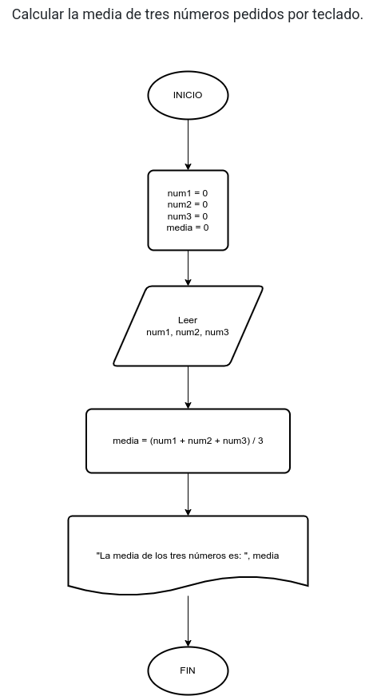

# Ejercicio 6

## Planteamiento del problema

Calcular la media de tres números pedidos por teclado.

### Análisis

- Datos de entrada: Tres números.
- Datos de salida: La media aritmética de esos tres números.
- Variables: num1, num2, num3, media: Numéricas reales.
- Cálculos: `media = (num1 + num2 + num3) / 3`

### Diseño

1. Ingresamos por teclado datos y almacenarlos en las variables *num1*, *num2*, y *num3*.
2. Realizar los cálculos para hallar la *media*.
3. Escribir por pantalla la *media*.

## Diagrama de flujo

