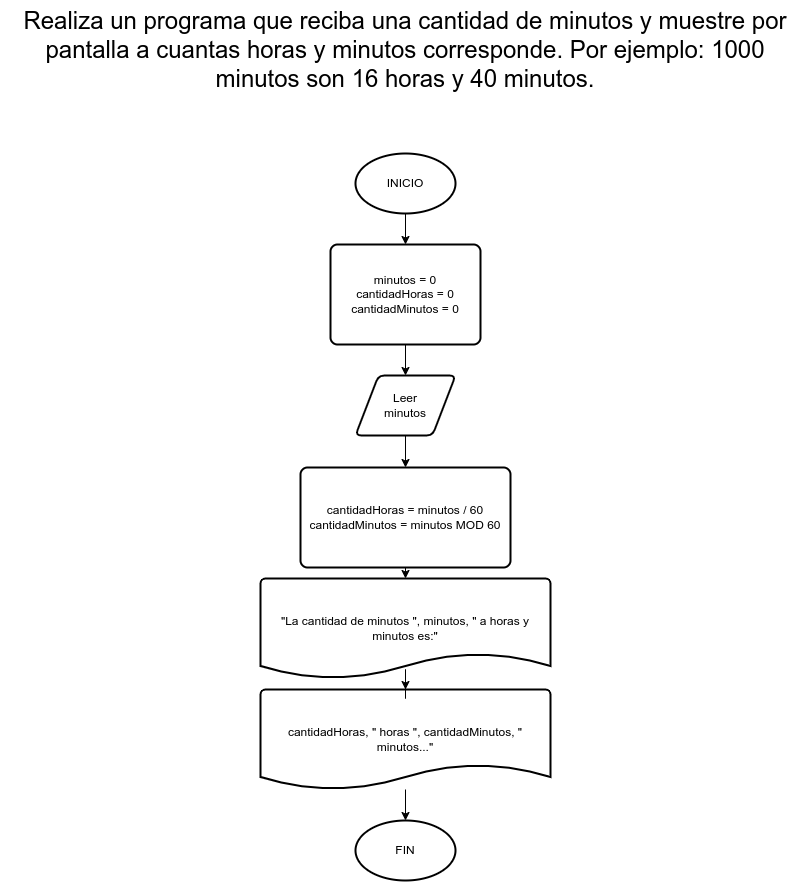

# Ejercicio 7

## Planteamiento del problema

Realiza un programa que reciba una cantidad de minutos y muestre por pantalla a cuantas horas y minutos corresponde. Por ejemplo: 1000 minutos son 16 horas y 40 minutos.

### Análisis

- **Datos de entrada:** Minutos.
- **Datos de salida:** Horas y minutos correspondientes a minutos.
- **Variables:** minutos, cantidadHoras, cantidadMinutos: Numéricas Enteras.
- _Cálculos:_ El resultado de la división con 60 son las horas y el resultado de su residuo son los minutos...
```C
cantidadHoras = minutos / 60 // 16
cantidadMinutos = minutos % 60 // 40
// La división se tiene que truncar sí o sí.
```

### Diseño

1. Ingresamos el dato entero.
2. Asignarlo en la variable *minutos*.
3. Realizar los cálculos de la división de los minutos.
4. El resultado de la división asignarlo en la variable *cantidadHoras*.
5. Realizar los cálculos del módulo de la división de los minutos.
6. El resultado del módulo de la división asignarlo en la variable *cantidadMinutos*.
7. Escribir los resultados de *cantidadHoras* y *cantidadMinutos* por pantalla.

## Diagrama de flujo


