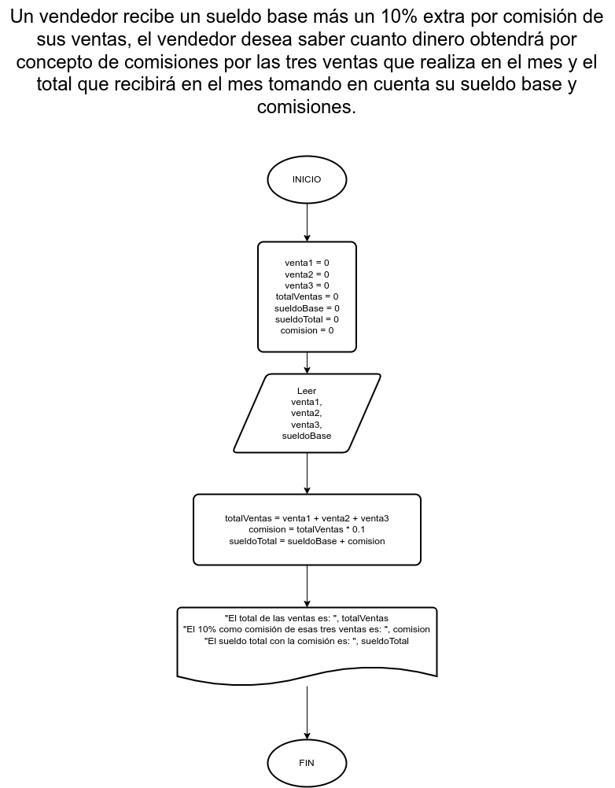

# Ejercicio 8

## Planteamiento del problema

Un vendedor recibe un sueldo base más un 10% extra por comisión de sus ventas, el vendedor desea saber cuanto dinero obtendrá por concepto de comisiones por las tres ventas que realiza en el mes y el total que recibirá en el mes tomando en cuenta su sueldo base y comisiones.

### Análisis

- **Datos de entrada:** Las tres ventas que realizó en el mes, y su sueldo base.
- **Datos de salida:** Las tres ventas totales, y su sueldo más el 10% de comisión.
- **Variables:** venta1, venta2, venta3, totalVentas, sueldoBase, sueldoTotal, comision: Numéricas Reales
- _Cálculos:_
```C
comision = (venta1 + venta2 + venta3) * 0.1
// OR
totalVentas = venta1 + venta2 + venta3
comision = totalVentas * 0.1
sueldoTotal = sueldoBase + comision
```

### Diseño

1. Ingresar los datos numéricos.
2. Asignarlos en las variables *venta1*, *venta2*, *venta3*.
3. Asignar en la variable *totalVentas* la suma de las tres ventas.
4. Asignar en la variable *comision* el 10% del total de las ventas.
5. Asignar en la variable *sueldoTotal* la suma del sueldo base más la comisión.

## Diagrama de flujo


