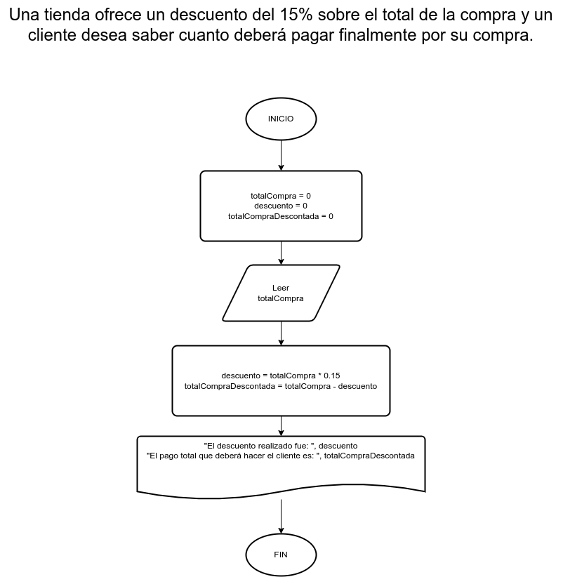

# Ejercicio 9                     

## Planteamiento del problema

Una tienda ofrece un descuento del 15% sobre el total de la compra y un cliente desea saber cuanto deberá pagar finalmente por su compra.

### Análisis

- **Datos de entrada:** El total de su compra.
- **Datos de salida:** El descuento del 15% de su compra.
- **Variables:** totalCompra, descuento, totalCompraDescontada: Numéricas Reales.
- _Cálculos:_
```C
descuento = totalCompra * 0.15
totalCompraDescontada = totalCompra - descuento
```

### Diseño

1. Ingresar el total de la compra.
2. Asignar a la variable *totalCompra* el total de la compra.
3. Realizar el descuento del 15% del total de la compra.
4. Asignar dicho descuento a la variable *descuento*.
5. Escribir lo que finalmente pagará el cliente.

## Diagrama de flujo


