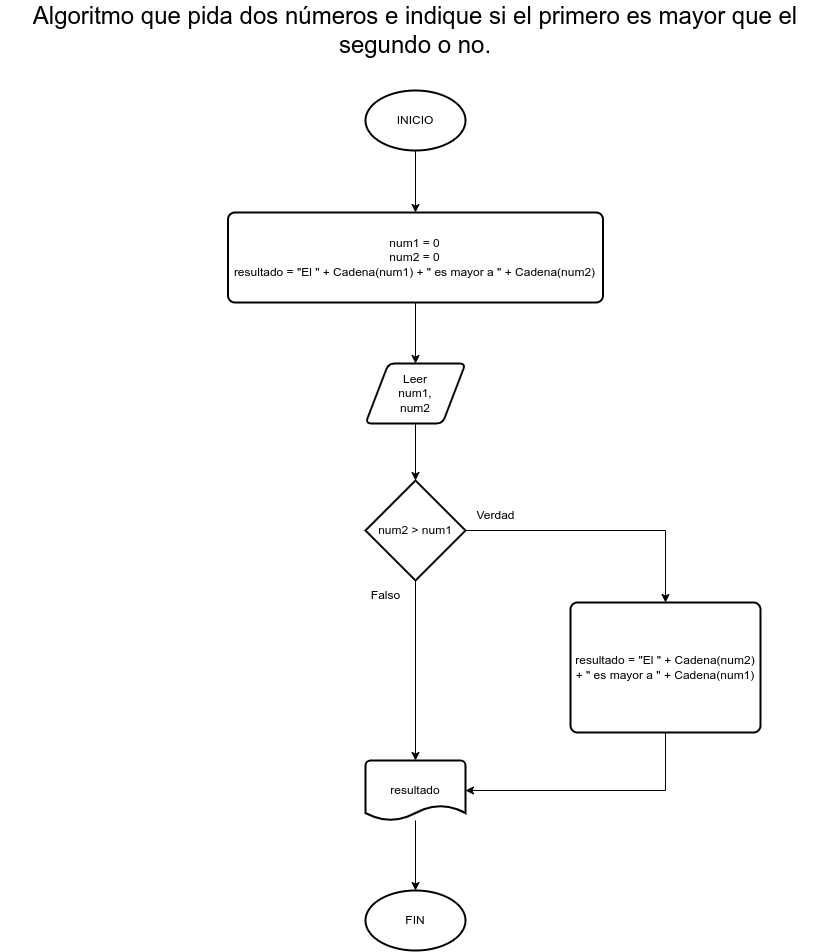

# Ejercicio 1 Selectivas

## Planteamiento del problema

Algoritmo que pida dos números e indique si el primero es mayor que el segundo o no.

### Análisis

- **Datos de entrada:** Dos números enteros.
- **Datos de salida:** El número mayor.
- **Variables:** num1, num2: Numéricas Enteras. También, resultado Como Carácter.

### Diseño

1. Leer dos números enteros.
2. Asignar dichos números en las variables *num1*, *num2*, respectivamente.
3. Asignar a la variable *resultado* el valor por defecto "El ", cadena(num1), " es mayor a ", cadena(num2).
4. Confirmar si el *num2* es mayor a *num1*.
    - Si es **VERDADERO**, asignar a la variable *resultado*: "El ", cadena(num2), " es mayor a ", cadena(num1).
5. Escribir el resultado final por pantalla.

## Diagrama de flujo

