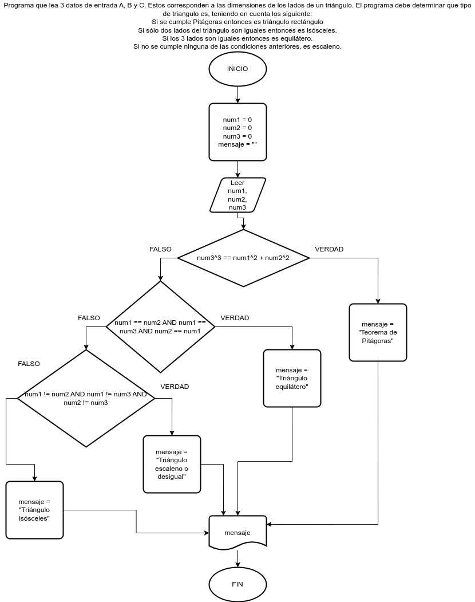

# Ejercicio 11 selectiva

## Planteamiento del problema

Programa que lea 3 datos de entrada A, B y C. Estos corresponden a las dimensiones de los lados de un triángulo. El programa debe determinar que tipo de triangulo es, teniendo en cuenta los siguiente:

- Si se cumple Pitágoras entonces es triángulo rectángulo.
- Si sólo dos lados del triángulo son iguales entonces es isósceles.
- Si los 3 lados son iguales entonces es equilátero.
- Si no se cumple ninguna de las condiciones anteriores, es escaleno.

### Análisis

- **Datos de entrada:** Tres datos numéricos: A, B, y C.
- **Datos de salida:** Dependiendo de dichos datos calcular el teorema de pitágoras, isósceles, equilátero, o escaleno.
- **Variables:** num1, num2, num3: Como reales; mensaje: Como Cáracter.
- _Cálculos:_
```C
a, b, y c.
Si c² = a² + b² es verdad, entonces es aplicable el teorema de pitágoras.
Si a == b OR c == a OR b == c, entonces es aplicable la fórmula de isósceles.
Si a == b AND a == c AND b == c, entonces es aplicable la fórmula de equilátero.
Si a != b AND a != c AND b != c, entonces es aplicable la fórmula de escaleno.
```

### Diseño

1. Ingresar tres datos numéricos.
2. Asignarlos en las variables *num1*, *num2*, *num3*.
3. Comparar si *num3*² es igual a la suma de los cuadrados de *num1* y *num2*.
4. Si es **VERDADERO**, entonces es teorema de pitágoras y asignamos en la variable *mensaje*.
5. Si es **FALSO**, entonces verificamos si *num1*, *num2*, y *num3* son todos iguales.
6. Si es **VERDADERO**, entonces se trata de un triángulo equilátero y asignamos en la variable *mensaje*.
7. Si es **FALSO**, verificamos si *num1*, *num2*, y *num3* son diferentes entre sí.
8. Si es **VERDADERO**, entonces se trata de un triángulo escaleno y asignamos en la variable *mensaje*.
9. Si es **FALSO**, finalmente damos por hecho que es un triángulo isósceles y asignamos en la variable *mensaje*.
10. Escribimos el resultado de *mensaje* por pantalla.

## Diagrama de flujo


