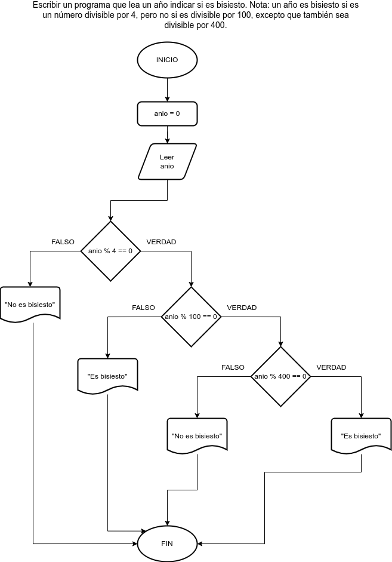

# Ejercicio 12 selectiva

## Planteamiento del problema

Escribir un programa que lea un año indicar si es bisiesto. Nota: un año es bisiesto si es un número divisible por 4, pero no si es divisible por 100, excepto que también sea divisible por 400.

### Análisis

- **Datos de entrada:** El año.
- **Datos de salida:** Dependiendo de la condición, si es bisiesto o no.
- **Variables:** anio: Como Entera.
- _Cálculos:_
```C
anio = 2023; // Ejemplo.
Si anio % 4 == 0 Entonces
    Si anio % 100 == 0 Entonces
        Si anio % 400 == 0 Entonces
            Escribir "El año ", anio, " es bisiesto."
        De lo Contrario
            Escribir "El año ", anio, " no es bisiesto."
        Fin(Si)
    De lo Contrario
        Escribir "El año ", anio, " es bisiesto."
    Fin(Si)
De lo Contrario
    Escribir "El año ", anio, " no es bisiesto."
Fin(Si)
```

### Diseño

1. Ingresar por teclado el año y asignarlo en la variable *anio*.
2. Verificar si el residuo de la división entre *anio* y 4 es cero.
3. En caso que sea **VERDADERO**, verificar si *anio* es divisible entre 100.
4. Nuevamente en caso que sea **VERDADERO**, entonces verificar nuevamente que es divisible entre 400.
5. Si resultó todo **VERDADERO**, entonces es año bisiesto.
6. Si el punto **2°** fue **FALSO**, entonces no es año bisiesto.
7. Si el punto **3°** fue **FALSO**, entonces el año sigue bisiesto.
8. Si el punto **4°** fue **FALSO**, entonces el año no es bisiesto.
9. En cada punto, escribir el respectivo resultado.

## Diagrama de flujo


