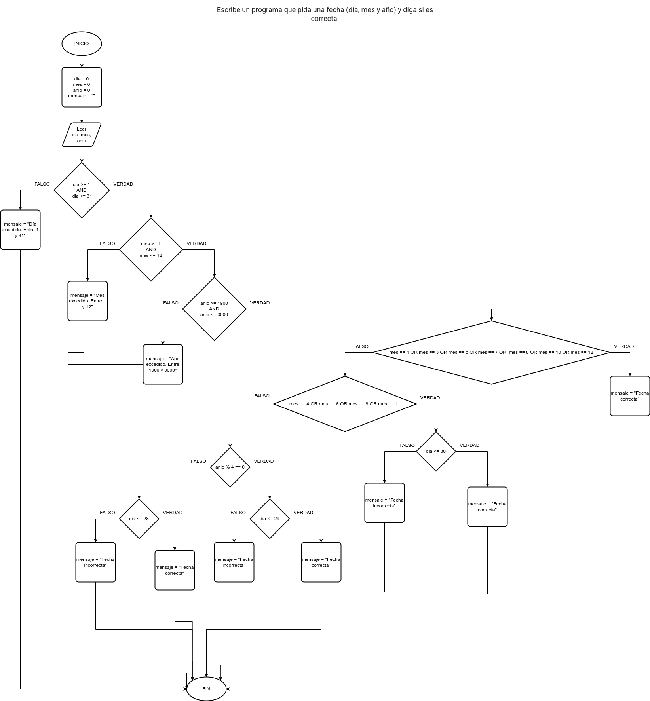

# Ejercicio 13 selectiva

## Planteamiento del problema

Escribe un programa que pida una fecha (día, mes y año) y diga si es correcta.

### Análisis

- **Datos de entrada:** Día, mes, y año.
- **Datos de salida:** Dependiendo de la condición, si se ingresó mal es incorrecto, sino es correcto.
- **Variables:** dia, mes, anio, resultado: Como Enteras; mensaje: Como Carácter.
- _Cálculos:_
```C
dia = 2 // O también 02.
mes = 7 // O también 07
anio = 2023

Si dia >= 1 Y dia <= 31 Entonces
    Si mes >= 1 Y mes <= 12 Entonces
        Si anio >= 1900 Y anio <= 3000 Entonces
            Casos
                :mes == 1, mes == 3, mes == 5, mes == 7, mes == 8, mes == 10, mes == 12: mensaje = "Fecha correcta"
                    SALTE
                :mes == 4, mes == 6, mes == 9, mes == 11:
                    Si dia <= 30 Entonces
                        mensaje = "Fecha correcta"
                    De lo Contrario
                        mensaje = "Fecha incorrecta"
                    Fin(Si)
                    SALTE
                :mes == 2: 
                    Si anio % 4 == 0 Entonces
                        Si dia <= 29 Entonces
                            mensaje = "Fecha correcta"
                        De lo Contrario
                            mensaje = "Fecha incorrecta"
                        Fin(Si)
                    De lo Contrario
                        Si dia <= 28 Entonces
                            mensaje = "Fecha correcta"
                        De lo Contrario
                            mensaje = "Fecha incorrecta"
                        Fin(Si)
                    Fin(Si)
                    SALTE
            Fin(Casos)
        De lo Contrario
            mensaje = "Año muy elevado o muy atrasado."
        Fin(Si)
    De lo Contrario
        mensaje = "Excede el mes. Tiene que oscilar entre 1 y 12."
    Fin(Si)
De lo Contrario
    mensaje = "Excede el límite de días. Tiene que ser entre 1 y 31."
Fin(Si)
Escriba(mensaje)
```

### Diseño

1. Ingresar el día, mes, y año, y asignarlos en las variables *dia*, *mes*, y *anio* respectivamente.
2. Confirmar si *dia* está dentro del rango de 1 al 31.
3. Confirmar si *mes* está dentro del rango 1 al 12.
4. Confirmar si *anio* está dentro del rango 1900 al 3000.
5. Si todo es **VERDADERO**, entonces realizar los cálculos correspondientes.
6. Confirmar si *mes* es alguno de estos meses: 1, 3, 5, 7, 8, 10, 12. 
7. Si es **VERDADERO**, entonces asignar en la variable *mensaje* que la fecha es correcta.
8. En otro caso, verificar si *mes* es alguno de estos meses: 4, 6, 9, 11.
9. Si es **VERDADERO**, confirmar si *dia* está dentro del rango del 1 al 30.
10. Si es **VERDADERO**, entonces asignar *mensaje* que la fecha es correcta.
11. Si es **FALSO**, entonces asignar *mensaje* que la fecha es incorrecta.
12. Último caso, si *mes* es febrero (2), entonces verificar si *anio* es bisiesto.
13. Si es **VERDADERO**, entonces verificar si está dentro del rango *dia* entre 1 y 29.
14. Si es **VERDADERO**, entonces asignar *mensaje* que la fecha es correcta.
15. Si es **FALSO**, entonces la fecha es incorrecta y asignarlo en *mensaje*.
16. Si es **FALSO** por no ser bisiesto, entonces verificar si *dia* oscila entre 1 y 28.
17. Si es **VERDADERO**, entonces la fecha es correcta y asignarlo en *mensaje*.
18. Si es **FALSO**, entonces la fecha es incorrecta y asignarlo en *mensaje*.
19. Si es **FALSO** porque *anio* excedió el límite, asignarlo en *mensaje*.
20. Si es **FALSO** porque *mes* excedió el límite, asignarlo en *mensaje*.
21. Si es **FALSO** porque *dia* excedió el límite, asignarlo en *mensaje*.
22. Escribir los resultados de la variable *mensaje* por pantalla.

## Diagrama de flujo


