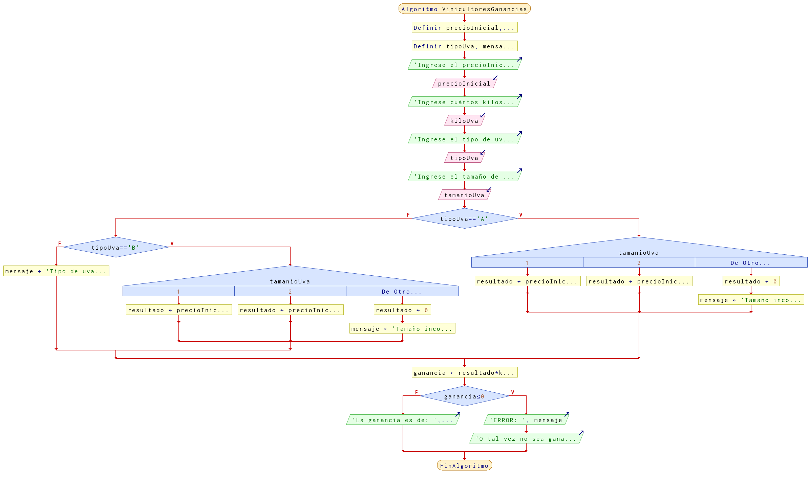

# Ejercicio 14 selectiva

## Planteamiento del problema

La asociación de vinicultores tiene como política fijar un precio inicial al kilo de uva, la cual se clasifica en tipos A y B, y además en tamaños 1 y 2. Cuando se realiza la venta del producto, ésta es de un solo tipo y tamaño, se requiere determinar cuánto recibirá un productor por la uva que entrega en un embarque, considerando lo siguiente:
- Si es de tipo A, se le cargan 20 céntimos al precio inicial cuando es de tamaño 1; y 30 céntimos si es de tamaño 2. 
- Si es de tipo B, se rebajan 30 céntimos cuando es de tamaño 1, y 50 céntimos cuando es de tamaño 2. 
Realice un algoritmo para determinar la ganancia obtenida.

### Análisis

- **Datos de entrada:** Precio inicial al kilo de uva, kilo de uva, tipo de uva (A, B), y tamaño (1, 2).
- **Datos de salida:** La ganancia obtenida dependiendo de ciertas condiciones.
- **Variables:** precioInicial, kiloUva, tamanioUva, resultado, ganancia: Numéricas Reales; mensaje, tipoUva: Como Carácter.
- _Cálculos:_
```C
precioInicial = 5€ // Inicialmente...
kiloUva = 3 // Tres kilogramos.
tamanioUva = 2 
tipoUva = "B"
ganancia 0

Si tipoUva == "A" Entonces
    Casos
        :tamanioUva == 1: resultado = precioInicial + 0.20
            SALTE
        :tamanioUva == 2: resultado = precioInicial + 0.30
            SALTE
        :otro_caso: mensaje = "Tamaño no válido"
                    resultado = 0
    Fin(Casos)
De lo Contrario
    Si tipoUva == "B" Entonces
        Casos
            :tamanioUva == 1: resultado = precioInicial - 0.30
                SALTE
            :tamanioUva == 2: resultado = precioInicial - 0.50
                SALTE
            :otro_caso: mensaje = "Tamaño no válido"
                        resultado = 0
        Fin(Casos)
    De lo Contrario
        mensaje = "Opción no válida"
    Fin(Si)
Fin(Si)

ganancia = resultado * kiloUva
```

### Diseño

1. Ingresar el precio inicial, los kilos, el tipo de uva, y el tamaño.
2. Asignar dichos valores en las variables *precioInicial*, *kiloUva*, *tipoUva*, y *tamanioUva*.
3. Verificar si *tipoUva* es igual a "A".
4. Si es **VERDADERO**, entonces verificar si *tamanioUva* es igual a uno.
5. Si es **VERDADERO**, entonces asignar *resultado* la suma de 0.20 con *precioInicial*.
6. Si es **FALSO**, entonces el *tamanioUva* es igual a dos.
7. Asignar *resultado* la suma de 0.20 con *precioInicial*.
8. En dado caso que ninguna de las condiciones es correcta, entonces asignar un mensaje de error en *mensaje*.
9. Verificar si *tipoUva* es igual a "B".
10. Si es **VERDADERO** que *tamanioUva* es igual a uno, entonces asignar la resta de 0.30 con *precioFinal*.
11. Si es **VERDADERO** que *tamanioUva* es igual a dos, entonces asignar la resta de 0.50 con *precioFinal*.
12. En el caso que ninguna opción sea la correcta, asignar mensajes de error en *mensaje*.
13. Asignar al precio final o *ganancia* el producto de *kiloUva* con *resultado*.
14. Verificar si hubo alguna o no.
15. Si hubo ganancia, escribir por pantalla.
16. Sino, entonces escribir por pantalla que hubo un error o que se ingresó mal algún componente.

## Diagrama de flujo


