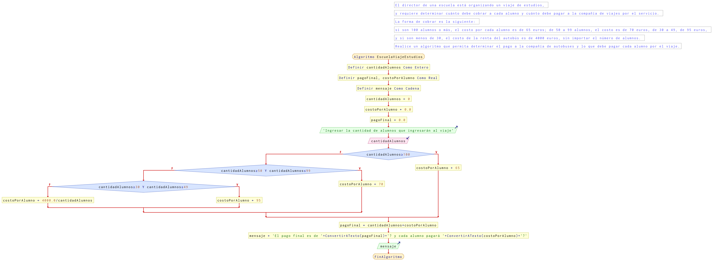

# Ejercicio 15 selectiva

## Planteamiento del problema

El director de una escuela está organizando un viaje de estudios, y requiere determinar cuánto debe cobrar a cada alumno y cuánto debe pagar a la compañía de viajes por el servicio.
La forma de cobrar es la siguiente: 
- Si son 100 alumnos o más, el costo por cada alumno es de 65 euros; de 50 a 99 alumnos, el costo es de 70 euros, de 30 a 49, de 95 euros, 
- Si son menos de 30, el costo de la renta del autobús es de 4000 euros, sin importar el número de alumnos. 
Realice un algoritmo que permita determinar el pago a la compañía de autobuses y lo que debe pagar cada alumno por el viaje.

### Análisis

- **Datos de entrada:** Cantidad de alumnos.
- **Datos de salida:** El pago final a la compañía de autobuses, y el costo que debe pagar por alumno.
- **Variables:** cantidadAlumnos: Numérica Entera; pagoFinal, costoPorAlumno: Numéricas Reales; mensaje: Como Carácter.
- _Cálculos:_
```C
Si cantidadAlumnos >= 100 Entonces
    costoPorAlumno = 65
De lo Contrario
    Si cantidadAlumnos >= 50 AND cantidadAlumnos <= 99 Entonces
        costoPorAlumno = 70
    De lo Contrario
        Si cantidadAlumnos >= 30 AND cantidadAlumnos <= 49 Entonces
            costoPorAlumno = 95
        De lo Contrario
            costoPorAlumno = 4000.0 / cantidadAlumnos
        Fin(Si)
    Fin(Si)
Fin(Si)
pagoFinal = cantidadAlumnos * costoPorAlumno
```

### Diseño

1. Asignar a cero *costoPorAlumno* y *pagoFinal*.
2. Asignar a *mensaje*: `"El pago final es de " + cadena(pagoFinal) + "€ y cada alumno pagará " + cadena(costoPorAlumno) + " €"`.
3. Ingresar los datos de la cantidad de alumnos.
4. Asignar dichos datos en la variable *cantidadAlumnos*.
5. Verificar si *cantidadAlumnos* es mayor o igual a 100.
6. Si es **VERDADERO**, entonces *costoPorAlumno* es de 65.
7. Si es **FALSO**, entonces verificar si *cantidadAlumno* mayor o igual a 50 y menor o igual a 99.
8. Si es **VERDADERO**, entonces *costoPorAlumno* es de 70.
9. Si es **FALSO**, entonces verificar si *cantidadAlumno* es mayor o igual a 30 y menor o igual a 49.
10. Si es **VERDADERO**, entonces *costoPorAlumno* es de 95.
11. Si es **FALSO**, entonces 4000 se dividirá por *cantidadAlumnos* y asignar dicho resultado en *costoPorAlumno*.
12. Al final de todo, *pagoFinal* se multiplicará *cantidadAlumnos* por *costoPorAlumno*.
13. Escribir por pantalla la variable *mensaje* con los nuevos datos.

## Diagrama de flujo


