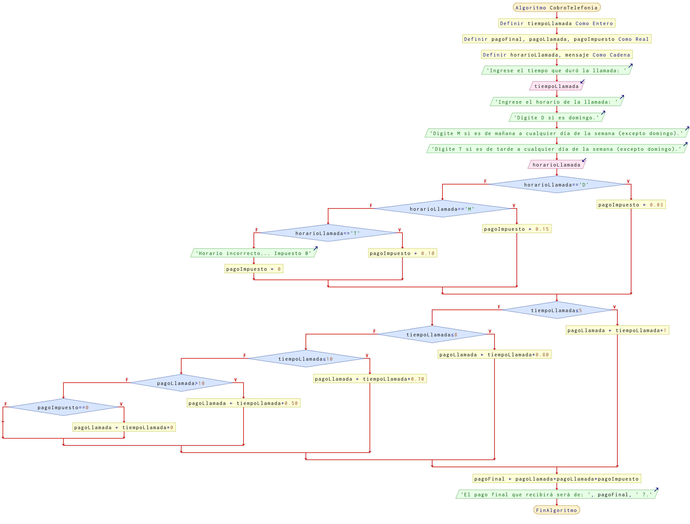

# Ejercicio 16 selectiva

## Planteamiento del problema

La política de cobro de una compañía telefónica es: cuando se realiza una llamada, el cobro es por el tiempo que ésta dura, de tal forma que los primeros cinco minutos cuestan 1 euro, los siguientes tres, 80 céntimos, los siguientes dos minutos, 70 céntimos, y a partir del décimo minuto, 50 céntimos. Además, se carga un impuesto de 3 % cuando es domingo, y si es otro día, en turno de mañana, 15 %, y en turno de tarde, 10 %. Realice un algoritmo para determinar cuánto debe pagar por cada concepto una persona que realiza una llamada.

### Análisis

- **Datos de entrada:** Tiempo que dura la llamada, y el horario en el cual se realiza la llamada.
- **Datos de salida:** El pago total por realizar la llamada, dependiendo de varios factores.
- **Variables:** tiempoLlamada: Como Entera; pagoFinal, pagoLlamada, pagoImpuesto: Como Real; horarioLlamada, mensaje: Como Carácter.
- _Cálculos:_
```C
tiempoLlamada = x minutos
horarioLlamada = y en carácter. Puede ser "D" de domingo, "M" de turno mañana, y "T" de turno tarde.
Casos:
        horarioLlamada == "D": pagoImpuesto = 0.03
        horarioLlamada == "M": pagoImpuesto = 0.15
        horarioLlamada == "T": pagoImpuesto = 0.10
Si tiempoLlamada <= 5:
    pagoLlamada = tiempoLlamada * 1
    SiNo Si tiempoLlamada <= 8
        pagoLlamada = tiempoLlamada * 0.80
        SiNo Si tiempoLlamada <= 10
            pagoLlamada = tiempoLlamada * 0.70
            SiNo 
                pagoLlamada = tiempoLlamada * 0.50

pagoFinal = pagoLlamada + pagoImpuesto.
```

### Diseño

1. Ingresar el tiempo de llamada y el horario de la llamada.
2. Asignar los datos en las variables tiempoLlamada y horarioLlamada.
3. Confirmar los casos en el cual el *horarioLlamada* sea los siguientes: "D" o "M" o "T".
4. Si es "D", entonces el *pagoImpuesto* será del 3%. Corresponde a domingo.
5. Si es "M", entonces el *pagoImpuesto* será del 15%. Corresponde días entre semana de mañana, incluyendo sábados.
6. Si es "T", entonces el *pagoImpuesto* será del 10%. Corresponde días entre semana de tarde, incluyendo sábados.
7. Verificar si *tiempoLlamada* es menor o igual a 5, entonces se le cobrará por un euro.
8. Sino, verificar si *tiempoLlamada* es menor o igual a 8, entonces se le cobrará por 80 céntimos.
9. Sino, verificar si *tiempoLlamada* es menor o igual a 10, entonces se le cobrará por 70 céntimos.
10. Ninguno fue verdadero, entonces se le cobrará por 50 céntimos. Porque pasó más de 10 minutos.
11. Al final, calcular el pago final con la suma del pago por la llamada y por los impuestos requeridos.
12. Escribir el programa con la variable *pagoFinal*.

## Diagrama de flujo


