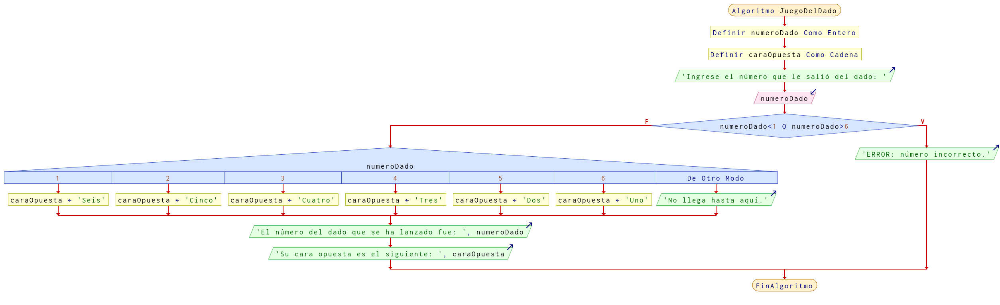

# Ejercicio 17 selectiva

## Planteamiento del problema

Realiza un programa que pida por teclado el resultado (dato entero) obtenido al lanzar un dado de seis caras y muestre por pantalla el número en letras (dato cadena) de la cara opuesta al resultado obtenido.

- Nota 1: En las caras opuestas de un dado de seis caras están los números: 1-6, 2-5 y 3-4.
- Nota 2: Si el número del dado introducido es menor que 1 o mayor que 6, se mostrará el mensaje: "ERROR: número incorrecto.".

> Ejemplo: \
> Introduzca número del dado: 5 \
> En la cara opuesta está el "dos".

### Análisis

- **Datos de entrada:** Número del dado.
- **Datos de salida:** La cara opuesta en forma de cadena.
- **Variables:** numeroDado: Como Entera; caraOpuesta: Como Carácter.
- _Cálculos:_
```C
Casos
    Si numeroDado = 1 Entonces la cara opuesta es "seis"
    Si numeroDado = 6 Entonces la cara opuesta es "uno"
    Si numeroDado = 2 Entonces la cara opuesta es "cinco"
    Si numeroDado = 5 Entonces la cara opuesta es "dos"
    Si numeroDado = 3 Entonces la cara opuesta es "cuatro"
    Si numeroDado = 4 Entonces la cara opuesta es "tres"
```

### Diseño

1. Ingresar por teclado el valor numérico entero para almacenarlo en la variable `numeroDado`.
2. Confirmar en casos las posibilidades de la cara opuesta.
3. Si `numeroDado` es 1, entonces la cara opuesta es seis.
4. Si `numeroDado` es 6, entonces la cara opuesta es uno.
5. Si `numeroDado` es 2, entonces la cara opuesta es cinco.
6. Si `numeroDado` es 5, entonces la cara opuesta es dos.
7. Si `numeroDado` es 3, entonces la cara opuesta es cuatro.
8. Si `numeroDado` es 4, entonces la cara opuesta es tres.
9. El resultado final almacenarlo en la variable `caraOpuesta`.
10. Escribir por pantalla el resultado final.

## Diagrama de flujo


