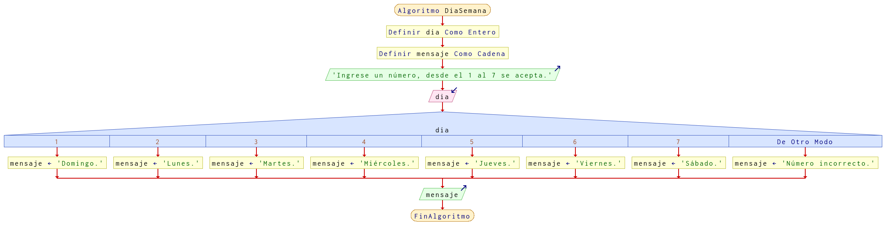

# Ejercicio 18 selectiva

## Planteamiento del problema

Realiza un programa que pida el día de la semana (del 1 al 7) y escriba el día correspondiente. Si introducimos otro número nos da un error.

### Análisis

- **Datos de entrada:** Día de la semana en número entero.
- **Datos de salida:** Día de la semana en carácter.
- **Variables:** diaSemana: Como Entero.
- _Cálculos:_
```C
1. Corresponde Domingo.
2. Corresponde Lunes.
3. Corresponde Martes.
4. Corresponde Miércoles.
5. Corresponde Jueves.
6. Corresponde Viernes.
7. Corresponde Sábado.
```

### Diseño

1. Ingresar por teclado un dato numérico y asignarlo en la variable `diaSemana`.
2. Verificar si es uno, siendo domingo.
3. De lo contrario, verificar si es 2, siendo lunes.
4. De otro modo, verificar si es 3, siendo martes.
5. De lo contrario, verificar si es 4, siendo miércoles.
6. De otro modo, verificar si es 5, siendo jueves.
7. De otro modo, verificar si es 6, siendo viernes.
8. Sino, verificar si es 7, siendo sábado.
9. Si ninguna fue válida, entonces el dato es incorrecto.
10. Escribir el resultado correspondiente por pantalla.

## Diagrama de flujo


