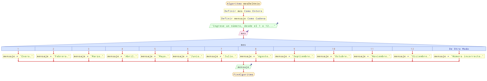

# Ejercicio 19 selectiva

## Planteamiento del problema

Escribe un programa que pida un número entero entre uno y doce e imprima el número de días que tiene el mes correspondiente.

### Análisis

- **Datos de entrada:** Mes del año en número entero.
- **Datos de salida:** Mes del año en carácter.
- **Variables:** mes: Como Entero.
- _Cálculos:_
```C
1. Corresponde Enero.
2. Corresponde Febrero.
3. Corresponde Marzo.
4. Corresponde Abril.
5. Corresponde Mayo.
6. Corresponde Junio.
7. Corresponde Julio.
8. Corresponde Agosto.
9. Corresponde Septiembre.
10. Corresponde Octubre.
11. Corresponde Noviembre.
12. Corresponde Diciembre.
```

### Diseño

1. Ingresar por teclado un dato numérico y asignarlo en la variable `mes`.
2. Verificar si es uno, siendo enero.
3. De lo contrario, verificar si es 2, siendo febrero.
4. De otro modo, verificar si es 3, siendo marzo.
5. De lo contrario, verificar si es 4, siendo abril.
6. De otro modo, verificar si es 5, siendo mayo.
7. De otro modo, verificar si es 6, siendo junio.
8. Sino, verificar si es 7, siendo julio.
9. Sino, verificar si es 8, siendo agosto.
10. De lo contrario, verificar si es 9, siendo septiembre.
11. De lo contrario, verificar si es 10, siendo octubre.
12. De otro modo, verificar si es 11, siendo noviembre.
13. De lo contrario, verificar si es 12, siendo diciembre.
14. Si ninguna fue válida, entonces el dato es incorrecto.
15. Escribir el resultado correspondiente por pantalla.

## Diagrama de flujo


