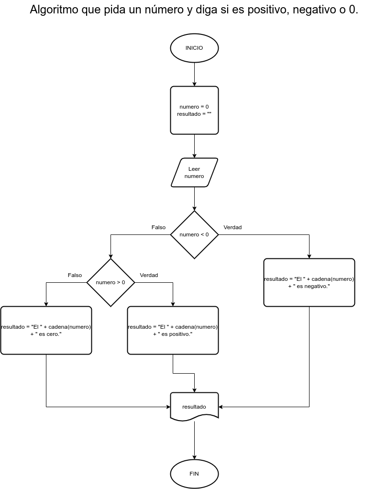

# Ejercicio 2 selectivas

## Planteamiento del problema

Algoritmo que pida un número y diga si es positivo, negativo o 0.

### Análisis

- **Datos de entrada:** Un número entero.
- **Datos de salida:** Decir si es positivo, negativo, o cero.
- **Variables:** numero: Como Entero, y resultado Como Carácter.

### Diseño

1. Ingresar un número entero.
2. Asignar el número en la variable *numero*.
3. Confirmar si el *numero* es negativo.
    - Si es verdad, asignar el texto "El " + cadena(numero) + " es negativo." en la variable *resultado*.
    - Caso contrario, confirmar si el *numero* es positivo, asignar en la variable *resultado* el siguiente texto: "El " + cadena(numero) + " es positivo."
    - En todo caso, asignar en la variable *resultado*: "El " + cadena(numero) + " es cero."
4. Escribir en pantalla la variable *resultado*.

## Diagrama de flujo

