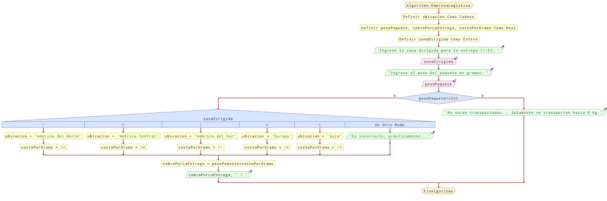

# Ejercicio 20 selectiva

## Planteamiento del problema

Una compañía de transporte internacional tiene servicio en algunos países de América del Norte, América Central, América del Sur, Europa y Asia. El costo por el servicio de transporte se basa en el peso del paquete y la zona a la que va dirigido. Lo anterior se muestra en la tabla:

| Zona  | Ubicación | Costo/gramo |
|:-------------:|:-------------:|:-------------:|
| 1     | América del Norte | 24.00 Euros |
| 2      | América Central | 20.00 Euros |
| 3      | América del Sur | 21.00 Euros |
| 4      | Europa | 10.00 Euros |
| 5      | Asia | 18.00 Euros |

Parte de su política implica que los paquetes con un peso superior a 5 kg no son transportados, esto por cuestiones de logística y de seguridad. Realice un algoritmo para determinar el cobro por la entrega de un paquete o, en su caso, el rechazo de la entrega.

### Análisis

- **Datos de entrada:** Peso del paquete, la zona dirigida.
- **Datos de salida:** Cobro por la entrega de un paquete, o rechazo de la entrega.
- **Variables:** pesoPaquete, CobroPorLaEntrega, CostoPorGramo: Como Real; zonaDirigida: Como Entera; ubicacion: Como Carácter.

### Diseño

1. Ingresar el peso del paquete y la zona dirigida.
2. Verificar si el paquete es menor a 5000 gramos.
3. Si es verdad, verificar en cada caso la zona dirigida.
4. Si es falso, escribir un mensaje de rechazo.
5. Calcular el cobro por la entrega del paquete dependiendo del costo de la zona dirigida.
6. Escribir el cobro por la entrega del paquete y la ubicación.

## Diagrama de flujo

