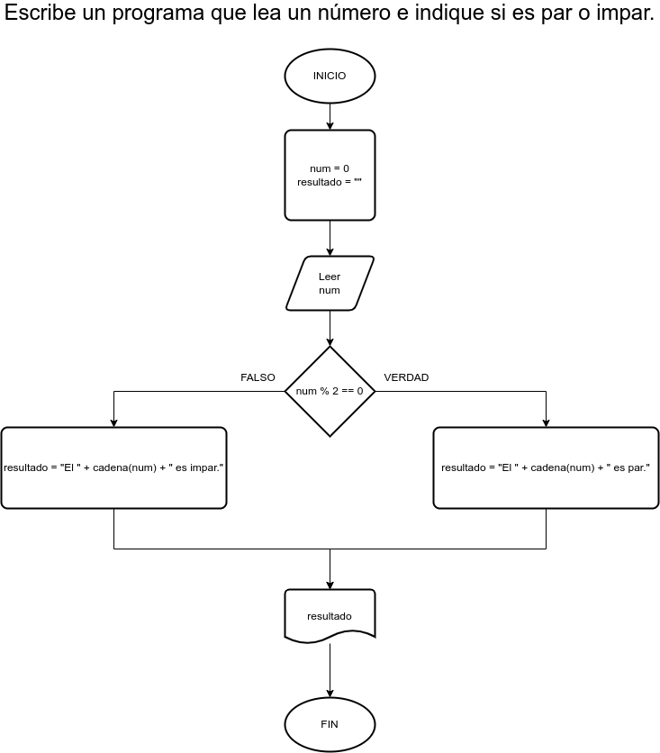

# Ejercicio 3 selectivas

## Planteamiento del problema

Escribe un programa que lea un número e indique si es par o impar.

### Análisis

- **Datos de entrada:** Un número entero.
- **Datos de salida:** El número si es par o si el número es impar.
- **Variables:** num: Como Entero, resultado: Como Carácter.
- _Cálculos:_
```C
num % 2 == 0 // Si es par.
num % 2 != 0 // Si es impar.
```

### Diseño

1. Leer un número entero por teclado.
2. Asignar dicho número en la variable *num*.
3. Verificar si *num* es divisible con dos dejando el residuo en cero.
4. Si es **VERDADERO**, asignar en la variable *resultado* lo siguiente: "El " + cadena(num) + " es par.".
5. En caso que sea **FALSO**, asignar en la variable *resultado* lo siguiente: "El " + cadena(num) + " es impar.".
6. Escribir en pantalla el resultado final.

## Diagrama de flujo


