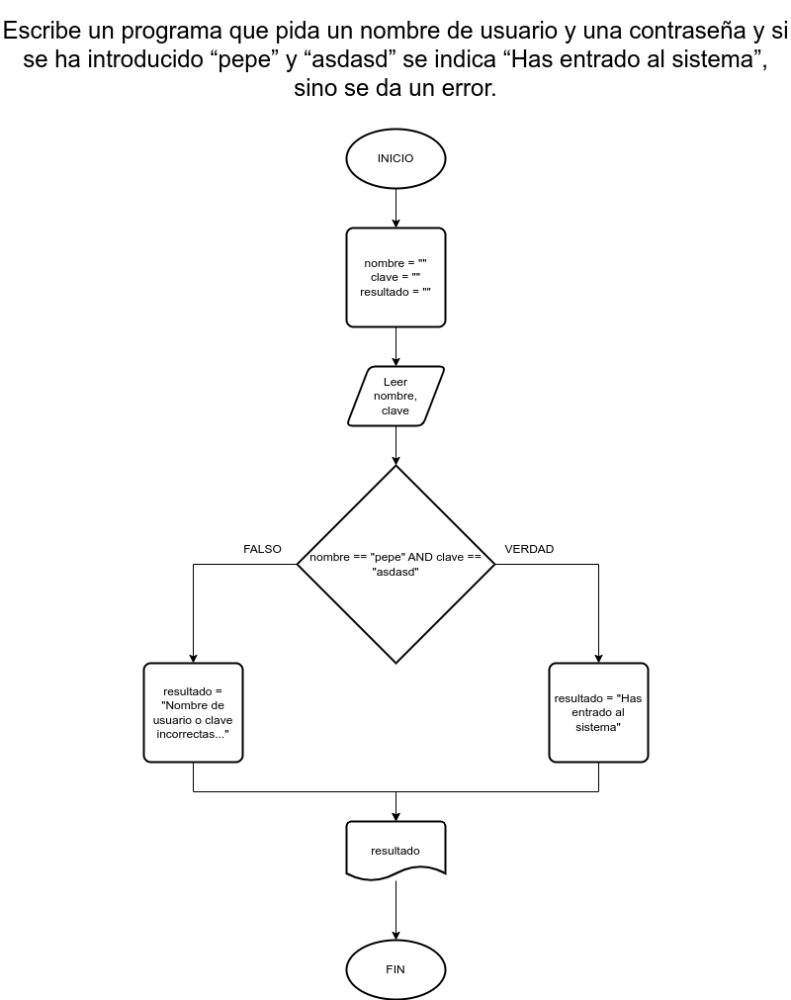

# Ejercicio 5 selectiva

## Planteamiento del problema

Escribe un programa que pida un nombre de usuario y una contraseña y si se ha introducido "pepe" y "asdasd" se indica "Has entrado al sistema", sino se da un error.

### Análisis

- **Datos de entrada:** Nombre de usuario, una contraseña.
- **Datos de salida:** Escribir "Has entrado al sistema" si el usuario y contraseña son válidos.
- **Variables:** nombre, clave, resultado: Como Carácter.

### Diseño

1. Ingresar el nombre de usuario y la contraseña.
2. Asignar dichos valores en las variables *nombre* y *clave* respectivamente.
3. Verificar si *nombre* es igual a "pepe" y *clave* es igual a "asdasd".
4. En caso que sea **VERDAD**, entonces asignar en la variable *resultado* el mensaje: "Has entrado al sistema".
5. En caso que sea **FALSO**, entonces asignar en la variable *resultado* el mensaje: "Nombre de usuario o clave no válido."
6. Escribir el resultado por pantalla.

## Diagrama de flujo

