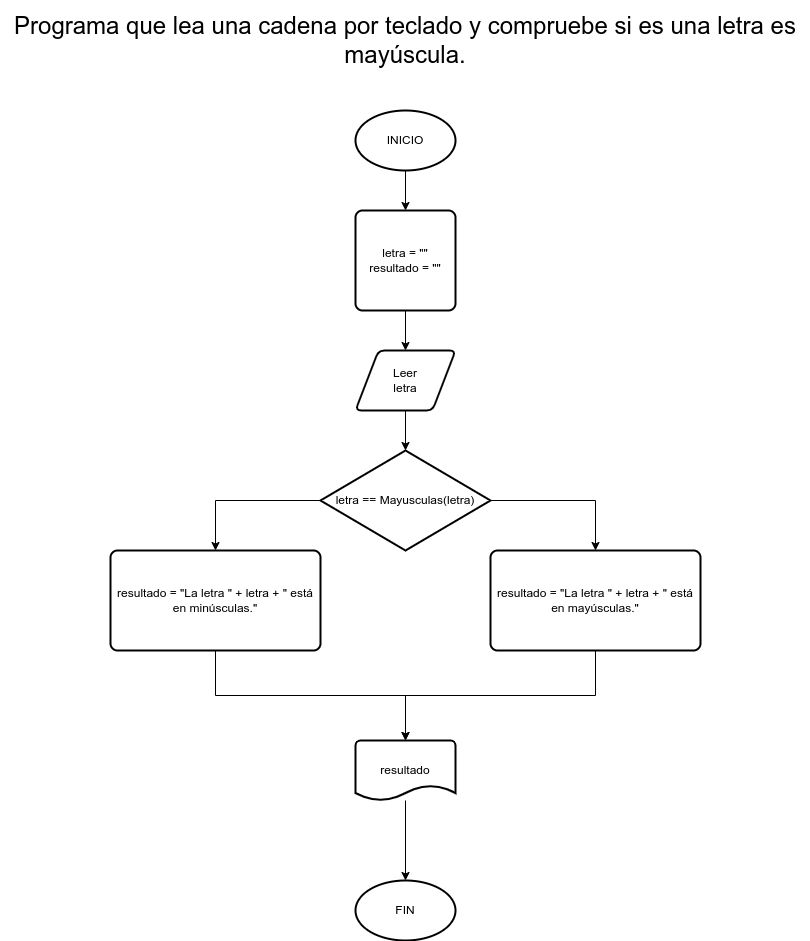

# Ejercicio 6 selectiva

## Planteamiento del problema

Programa que lea una cadena por teclado y compruebe si es una letra es mayúscula.

### Análisis

- **Datos de entrada:** Una letra.
- **Datos de salida:** Comprobar si es mayúscula o no.
- **Variables:** letra, resultado: Como Carácter.

### Diseño

1. Ingresar una letra por teclado.
2. Asignar dicha letra en la variable *letra*.
3. Confirmar si *letra* está en mayúsculas usando la función de mayúsculas.
4. En caso que sea **VERDAD**, asignar en la variable *resultado* lo siguiente: "La letra " + letra + " está en mayúsculas."
5. En caso que sea **FALSO**, asignar en la variable *resultado* lo siguiente: "La letra " + letra + " está en minúsculas."
6. Escribir el resultado por pantalla.

## Diagrama de flujo

